# 基于 SysML 顺序图的代码生成平台 — 详细设计文档

---

## 第一部分：画图工具设计

---

### 1. 通用画图工具的图持久化存储设计

#### 1.1 持久化格式选型

顺序图编辑器需要将用户绘制的图形持久化保存，主流方案有以下几种：

| 方案 | 格式 | 优势 | 劣势 |
|------|------|------|------|
| **JSON 自定义格式** | `.seqd.json` | 解析简单、前端原生支持、易于diff | 无行业标准 |
| **XMI/XML** | `.xmi` | SysML 标准交换格式，兼容第三方工具 | 解析复杂，冗余度高 |
| **SQLite 嵌入式数据库** | `.seqdb` | 支持复杂查询、事务性写入 | 不可读、难以版本控制 |

**推荐方案：JSON 为主存储 + XMI 为导入/导出格式**

理由：
- 项目前端基于 Vue（Tauri 架构），JSON 是天然的数据交换格式
- XMI 作为标准交换格式保留导入导出能力，兼容 Enterprise Architect、MagicDraw 等建模工具
- JSON 文件可直接纳入 Git 版本控制，支持 diff 和 merge

#### 1.2 JSON 持久化数据结构

```jsonc
{
  "version": "1.0.0",
  "metadata": {
    "id": "uuid-xxxx",
    "name": "登录认证顺序图",
    "createdAt": "2026-03-24T10:00:00Z",
    "updatedAt": "2026-03-24T12:30:00Z",
    "author": "user",
    // 代码生成输出路径绑定（见第二部分第5节）
    "codeGenConfig": {
      "outputDir": "./generated/login_auth",
      "language": "cpp",
      "templateSet": "default"
    }
  },

  // 生命线（参与者）
  "lifelines": [
    {
      "id": "ll-001",
      "name": "Client",
      "type": "class",           // class | actor | component | interface
      "position": { "x": 100, "y": 50 },
      "properties": {
        "stereotype": "<<boundary>>",
        "attributes": [],
        "namespace": "auth"
      }
    },
    {
      "id": "ll-002",
      "name": "AuthService",
      "type": "class",
      "position": { "x": 300, "y": 50 },
      "properties": {
        "stereotype": "",
        "attributes": [],
        "namespace": "auth"
      }
    },
    {
      "id": "ll-003",
      "name": "Database",
      "type": "class",
      "position": { "x": 500, "y": 50 },
      "properties": {
        "stereotype": "<<entity>>",
        "attributes": [],
        "namespace": "persistence"
      }
    }
  ],

  // 消息（调用关系）
  "messages": [
    {
      "id": "msg-001",
      "name": "login",
      "type": "sync",             // sync | async | return | create | destroy
      "sourceLifelineId": "ll-001",
      "targetLifelineId": "ll-002",
      "orderIndex": 1,
      "arguments": [
        { "name": "username", "type": "string" },
        { "name": "password", "type": "string" }
      ],
      "returnType": "bool",
      "guard": "",                // 守卫条件，如 "[isValid]"
      "parentFragmentId": null    // 所属 CombinedFragment，null 表示顶层
    },
    {
      "id": "msg-002",
      "name": "queryUser",
      "type": "sync",
      "sourceLifelineId": "ll-002",
      "targetLifelineId": "ll-003",
      "orderIndex": 2,
      "arguments": [
        { "name": "username", "type": "string" }
      ],
      "returnType": "UserRecord",
      "guard": "",
      "parentFragmentId": null
    }
  ],

  // 组合片段（控制结构）
  "combinedFragments": [
    {
      "id": "cf-001",
      "type": "alt",              // alt | loop | opt | par | break
      "parentFragmentId": null,
      "operands": [
        {
          "id": "op-001",
          "guard": "userFound",
          "messageIds": ["msg-003", "msg-004"]
        },
        {
          "id": "op-002",
          "guard": "else",
          "messageIds": ["msg-005"]
        }
      ]
    },
    {
      "id": "cf-002",
      "type": "loop",
      "parentFragmentId": null,
      "operands": [
        {
          "id": "op-003",
          "guard": "retryCount < 3",
          "messageIds": ["msg-006"]
        }
      ]
    }
  ],

  // 画布视图信息（仅用于UI还原，不参与代码生成）
  "viewState": {
    "zoom": 1.0,
    "panX": 0,
    "panY": 0,
    "gridEnabled": true,
    "gridSize": 20
  }
}
```

#### 1.3 保存与加载流程

**保存流程：**

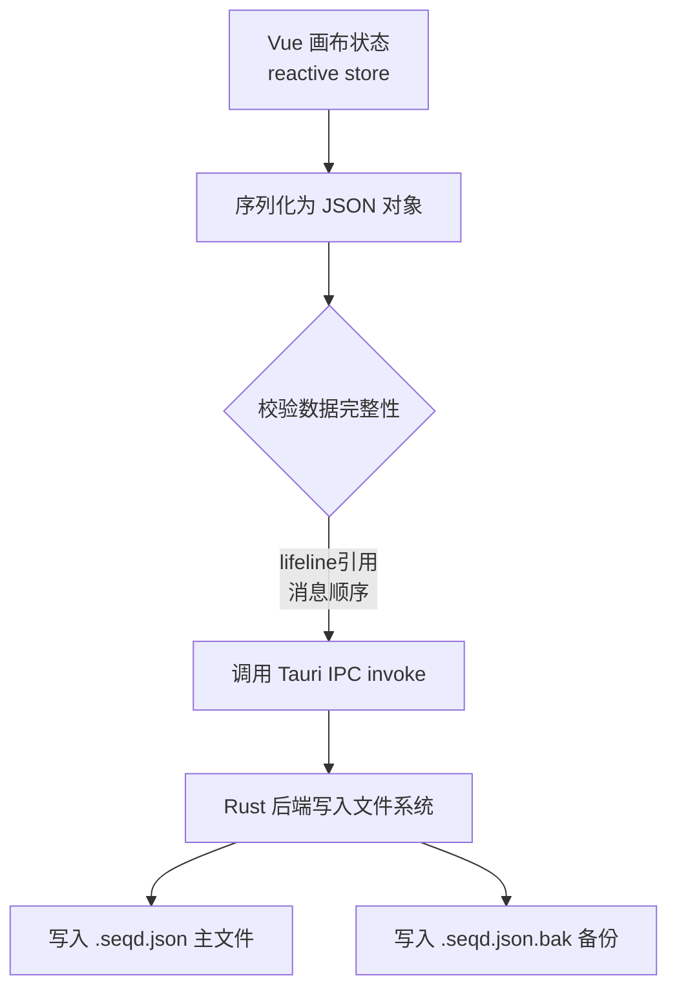

**加载流程：**

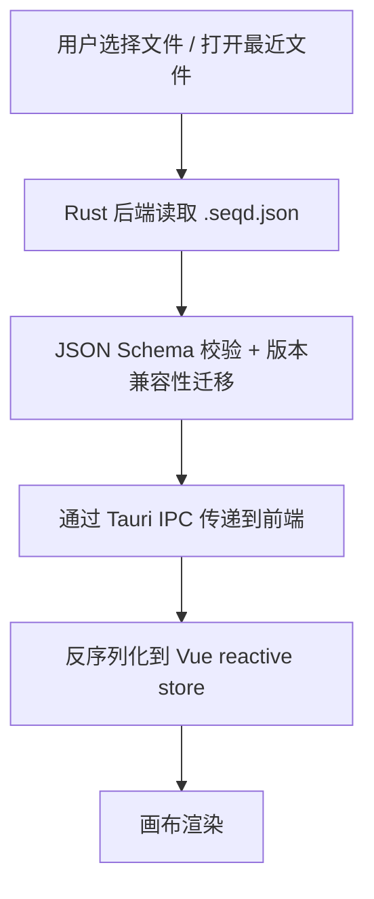

#### 1.4 自动保存机制

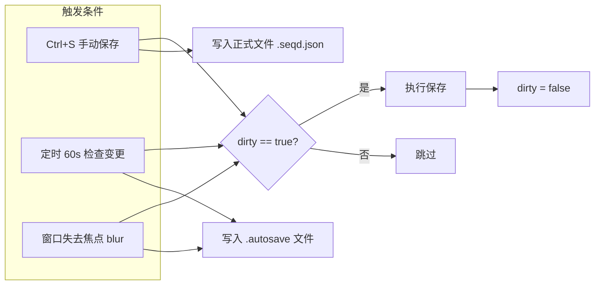

#### 1.5 Tauri IPC 文件操作接口设计

```rust
// Rust 后端 Tauri command 接口
#[tauri::command]
fn save_diagram(path: String, content: String) -> Result<(), String> {
    // 1. 写入备份
    // 2. 原子写入主文件（先写 .tmp 再 rename）
    // 3. 返回结果
}

#[tauri::command]
fn load_diagram(path: String) -> Result<String, String> {
    // 1. 读取文件
    // 2. 校验 JSON 格式
    // 3. 版本迁移（如果需要）
    // 4. 返回 JSON 字符串
}

#[tauri::command]
fn export_xmi(path: String, content: String) -> Result<(), String> {
    // JSON -> XMI 转换并保存
}

#[tauri::command]
fn import_xmi(path: String) -> Result<String, String> {
    // XMI -> JSON 转换并返回
}
```

---

### 2. 画图工具界面设计

#### 2.1 整体布局

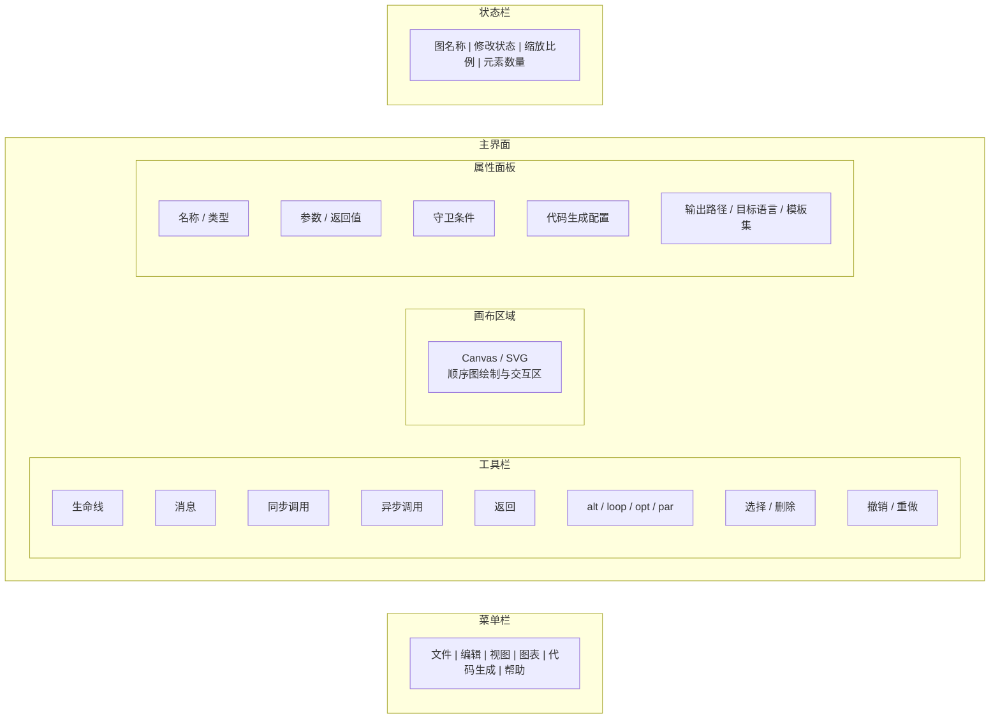

#### 2.2 核心 UI 组件树

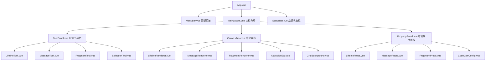

#### 2.3 画布交互设计

**绘制交互流程：**

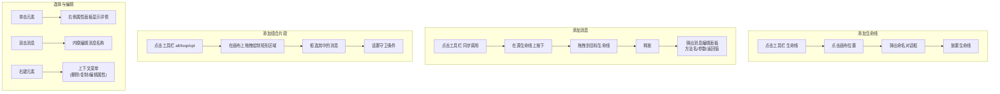

**键盘快捷键：**

| 快捷键 | 功能 |
|--------|------|
| `Ctrl+S` | 保存 |
| `Ctrl+Z` | 撤销 |
| `Ctrl+Y` | 重做 |
| `Ctrl+Shift+S` | 另存为 |
| `Delete` | 删除选中元素 |
| `Ctrl+D` | 复制选中元素 |
| `Ctrl+G` | 触发代码生成 |
| `Ctrl+E` | 导出 XMI |
| `Escape` | 取消当前操作/回到选择工具 |
| `+` / `-` | 缩放 |
| `Ctrl+0` | 重置缩放 |

#### 2.4 前端状态管理（Pinia Store）

```typescript
// stores/diagram.ts
interface DiagramState {
  metadata: DiagramMetadata
  lifelines: Lifeline[]
  messages: Message[]
  combinedFragments: CombinedFragment[]
  viewState: ViewState

  // UI 状态
  selectedElementId: string | null
  selectedElementType: 'lifeline' | 'message' | 'fragment' | null
  activeTool: ToolType
  isDirty: boolean

  // 历史记录（撤销/重做）
  undoStack: DiagramSnapshot[]
  redoStack: DiagramSnapshot[]
}
```

---

## 第二部分：代码生成设计

---

### 0. 模板引擎选型：为什么选择 Jinja2 而非 Xtend

#### 0.1 对比总览

| 维度 | Jinja2 (MiniJinja) | Xtend |
|------|---------------------|-------|
| **运行时依赖** | Rust 原生（MiniJinja crate），零外部依赖 | 需要 JVM + Eclipse Xtext 完整工具链 |
| **与项目架构契合度** | Tauri (Rust) 后端直接调用，无跨语言开销 | 必须引入 JVM 进程，架构割裂 |
| **学习成本** | 语法极简，`` / `{{ }}`，30 分钟上手 | 需学习 Xtend 语言 + Eclipse EMF 元模型体系 |
| **模板可读性** | 模板接近目标代码，所见即所得 | 富文本模板 `'''` 有隐式空白处理，调试困难 |
| **社区与生态** | 极其丰富（Python/Rust/JS 多语言实现） | 小众，基本只在 Eclipse MDD 圈内使用 |
| **独立性** | 可脱离任何框架独立运行 | 设计上绑定 Eclipse/EMF 模型驱动体系 |
| **集成方式** | `Cargo.toml` 加一行 `minijinja = "2"` | 需配置 Maven/Gradle + Xtext 插件链 |

#### 0.2 Jinja2 的核心优势

1. **Rust 原生集成**：通过 [MiniJinja](https://github.com/mitsuhiko/minijinja) crate 在 Tauri 后端直接渲染模板，无需启动额外进程，性能优异且部署简单

2. **模板语法直观**：模板文件与目标代码高度相似，非模板开发者也能一眼看懂生成逻辑
   ```jinja2
   
   {{ method.return_type }} {{ class.name }}::{{ method.name }}({{ method.params | format_params }}) {
       // ...
   }
   
   ```

3. **模板继承与组合**：支持 ``, ``, `` 等高级特性，天然适合将代码生成拆分为最小模板单元并自由组合

4. **多语言实现统一语法**：无论后端用 Rust (MiniJinja)、Python (Jinja2) 还是 JS (Nunjucks)，模板语法完全一致，团队协作无障碍

5. **丰富的过滤器和测试**：内置 `join`, `upper`, `default` 等过滤器，且可轻松自定义过滤器（如 `format_params` 格式化参数列表），减少模板中的逻辑复杂度

6. **调试友好**：模板渲染错误信息清晰，指明出错行号和上下文；Xtend 的空白处理和模板嵌套错误排查极为困难

#### 0.3 Xtend 的适用场景（不适合本项目）

Xtend 的优势在于与 Eclipse EMF/Xtext 深度集成——如果项目是在 Eclipse 插件体系内做 MDD（用 `.ecore` 元模型 + Xtext DSL），Xtend 是原生选择。但本项目基于 Tauri + Vue，自行解析 JSON/XMI，完全不依赖 Eclipse 生态，引入 Xtend 意味着强行加一个 JVM 依赖，没有收益。

#### 0.4 集成方式

```toml
# src-tauri/Cargo.toml
[dependencies]
minijinja = "2"
```

```rust
use minijinja::{Environment, context};

fn render_template(template_str: &str, ir_data: &serde_json::Value) -> String {
    let mut env = Environment::new();
    env.add_template("code", template_str).unwrap();
    let tmpl = env.get_template("code").unwrap();
    tmpl.render(context! { data => ir_data }).unwrap()
}
```

---

### 1. SysML 顺序图对应的代码设计模式

顺序图描述的是对象之间的交互行为，其核心元素与代码设计模式的对应关系如下：

#### 1.1 元素与设计模式映射

| 顺序图元素 | 代码设计模式 | 说明 |
|-----------|-------------|------|
| **Lifeline（生命线）** | **类定义** | 每个生命线对应一个类（或已有类的引用） |
| **同步消息 (sync)** | **方法调用** | `target.methodName(args)` |
| **异步消息 (async)** | **异步调用/事件发布** | 回调、Future/Promise、或消息队列发送 |
| **返回消息 (return)** | **return 语句** | 方法返回值 |
| **alt 片段** | **if-else 分支** | 守卫条件映射为 if 条件 |
| **loop 片段** | **while/for 循环** | 守卫条件映射为循环条件 |
| **opt 片段** | **if（无 else）** | 单分支条件 |
| **par 片段** | **并发/多线程** | `std::thread` 或 `std::async` |
| **create 消息** | **构造函数调用** | `new` / 栈构造 |
| **destroy 消息** | **析构/释放** | `delete` / 作用域结束 |
| **自调用 (self-message)** | **私有方法调用** | `this->method()` |

**映射关系图：**

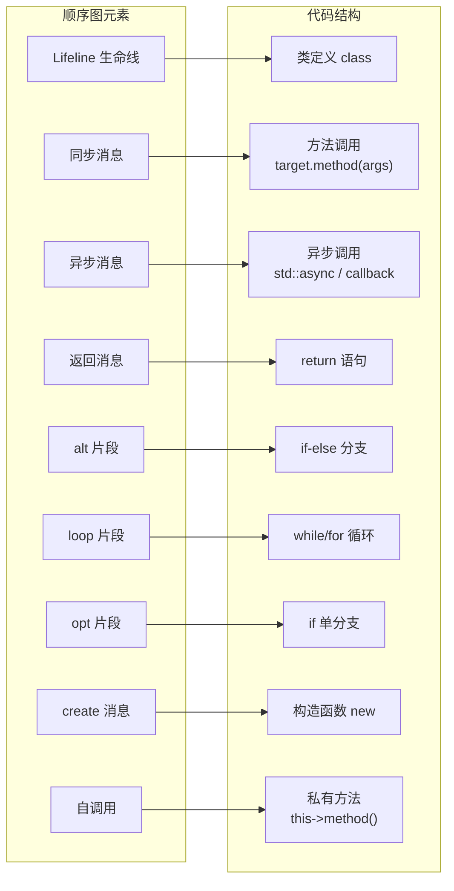

#### 1.2 完整代码映射示例

**顺序图描述：**

该顺序图描述了一个典型的登录认证流程，涉及三个参与者：
- **Client**（客户端）：发起登录请求
- **AuthService**（认证服务）：负责协调认证流程，是核心协调者
- **Database**（数据库）：提供用户数据查询

交互流程如下：
1. Client 向 AuthService 发送 `login(username, password)` 同步调用
2. AuthService 向 Database 发送 `queryUser(username)` 查询用户记录
3. Database 返回 `UserRecord` 给 AuthService
4. 进入 **alt（条件分支）**：
   - **[userFound]** 分支：AuthService 自调用 `validatePassword()` 验证密码，成功后向 Client 返回 token
   - **[else]** 分支：AuthService 向 Client 返回 error

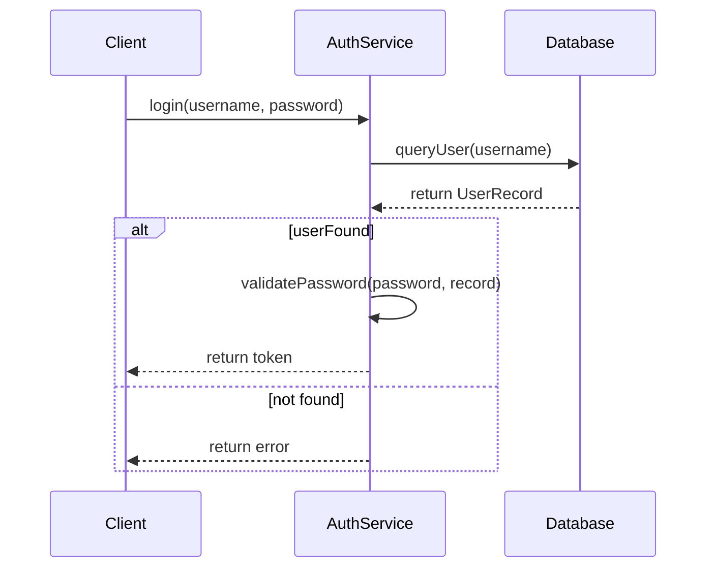

**生成的 C++ 代码：**

```cpp
// ===== AuthService.h =====
#pragma once
#include <string>

// Forward declarations
class Database;

class AuthService {
public:
    // <user-code-begin AuthService::public_members>
    // <user-code-end AuthService::public_members>

    std::string login(const std::string& username, const std::string& password);

private:
    Database* database_;

    bool validatePassword(const std::string& password, const UserRecord& record);

    // <user-code-begin AuthService::private_members>
    // <user-code-end AuthService::private_members>
};

// ===== AuthService.cpp =====
#include "AuthService.h"
#include "Database.h"

std::string AuthService::login(const std::string& username, const std::string& password) {
    // <user-code-begin AuthService::login::pre>
    // <user-code-end AuthService::login::pre>

    UserRecord record = database_->queryUser(username);

    if (/* userFound */) {
        // <user-code-begin AuthService::login::alt_userFound_condition>
        // <user-code-end AuthService::login::alt_userFound_condition>

        bool valid = this->validatePassword(password, record);

        // <user-code-begin AuthService::login::alt_userFound_body>
        // <user-code-end AuthService::login::alt_userFound_body>

        return token;
    } else {
        // <user-code-begin AuthService::login::alt_else_body>
        // <user-code-end AuthService::login::alt_else_body>

        return error;
    }

    // <user-code-begin AuthService::login::post>
    // <user-code-end AuthService::login::post>
}
```

#### 1.3 设计模式总结

顺序图本质上对应的是 **"协作模式"（Collaboration Pattern）**，具体体现为：

1. **Mediator 模式**：当一个生命线协调多个其他生命线时
2. **Chain of Responsibility**：当消息沿多个生命线依次传递时
3. **Observer 模式**：当使用异步消息时
4. **Command 模式**：每条消息可抽象为一个命令对象
5. **Template Method**：`alt/loop` 片段内的调用序列构成模板方法的步骤

---

### 2. 设计模式的最小单元分解（面向模板设计）

#### 2.1 分解原则

将代码生成拆解为最小的、可独立渲染的模板单元，遵循以下原则：

1. **单一职责**：每个模板单元只负责一种代码结构
2. **可组合**：小单元可以自由组合形成完整代码
3. **可替换**：切换目标语言只需替换同级别的模板单元

#### 2.2 最小模板单元（Template Units）

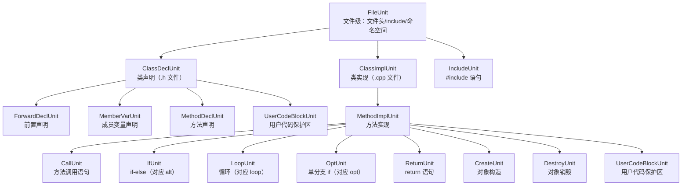

#### 2.3 各模板单元的详细定义

每个模板单元接收对应的 IR 节点，输出目标语言代码片段。以 Jinja2 模板为例：

**CallUnit — 方法调用（最基本的单元）：**

```jinja2
{# call_unit.cpp.j2 #}
{# 输入: call: CallStatement #}

{{ call.returnType }} {{ call.resultVar }} = {{ call.target }}.{{ call.methodName }}({{ call.arguments | join(', ') }});

{{ call.target }}.{{ call.methodName }}({{ call.arguments | join(', ') }});

```

**IfUnit — 条件分支：**

```jinja2
{# if_unit.cpp.j2 #}
{# 输入: fragment: IfStatement #}
if ({{ fragment.condition }}) {
    // <user-code-begin {{ scope }}::{{ fragment.id }}_condition>
    // <user-code-end {{ scope }}::{{ fragment.id }}_condition>

    {{ render_statement(stmt) }}

}

 else {

    {{ render_statement(stmt) }}

}

```

**LoopUnit — 循环：**

```jinja2
{# loop_unit.cpp.j2 #}
{# 输入: fragment: LoopStatement #}
while ({{ fragment.condition }}) {
    // <user-code-begin {{ scope }}::{{ fragment.id }}_condition>
    // <user-code-end {{ scope }}::{{ fragment.id }}_condition>

    {{ render_statement(stmt) }}

}
```

**MethodImplUnit — 方法实现（组合调度器）：**

```jinja2
{# method_impl_unit.cpp.j2 #}
{{ method.returnType }} {{ className }}::{{ method.name }}({{ method.params | format_params }}) {
    // <user-code-begin {{ className }}::{{ method.name }}::pre>
    // <user-code-end {{ className }}::{{ method.name }}::pre>


    {{ render_statement(stmt) }}


    // <user-code-begin {{ className }}::{{ method.name }}::post>
    // <user-code-end {{ className }}::{{ method.name }}::post>
}
```

**FileUnit — 文件级模板：**

```jinja2
{# file_unit.h.j2 #}
#pragma once


#include {{ inc }}



class {{ fwd }};



namespace {{ namespace }} {


{{ render_class_decl(classDecl) }}


} // namespace {{ namespace }}

```

#### 2.4 模板调度机制

```python
# 模板调度器：根据 IR 节点类型选择对应的模板单元
class TemplateDispatcher:
    """
    核心调度逻辑：IR Statement → 对应的 Jinja2 模板单元
    """

    TEMPLATE_MAP = {
        "CallStatement":   "call_unit.{lang}.j2",
        "IfStatement":     "if_unit.{lang}.j2",
        "LoopStatement":   "loop_unit.{lang}.j2",
        "OptStatement":    "opt_unit.{lang}.j2",
        "ReturnStatement": "return_unit.{lang}.j2",
        "CreateStatement": "create_unit.{lang}.j2",
        "DestroyStatement":"destroy_unit.{lang}.j2",
    }

    def render_statement(self, stmt, lang="cpp"):
        template_name = self.TEMPLATE_MAP[type(stmt).__name__].format(lang=lang)
        template = self.env.get_template(template_name)
        return template.render(stmt=stmt, render_statement=self.render_statement)
```

**调度流程：**

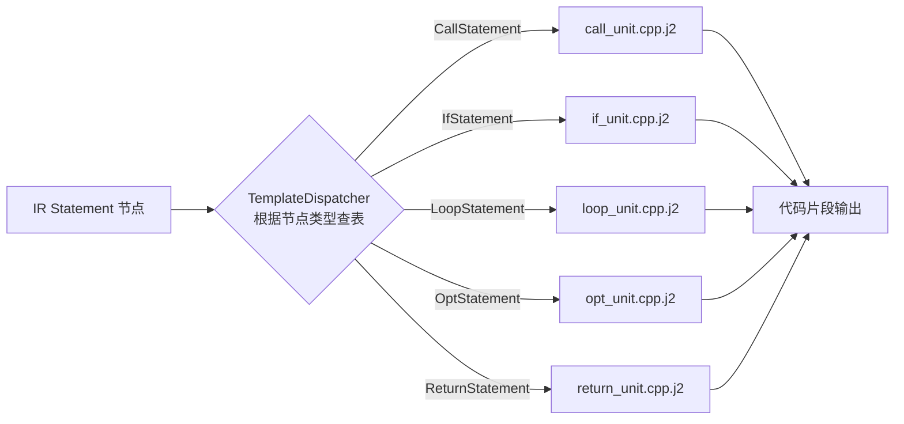

#### 2.5 多语言扩展

新增语言只需添加一套同名模板文件：

```
templates/
├── cpp/
│   ├── file_unit.h.j2
│   ├── file_unit.cpp.j2
│   ├── class_decl_unit.j2
│   ├── class_impl_unit.j2
│   ├── method_decl_unit.j2
│   ├── method_impl_unit.j2
│   ├── call_unit.j2
│   ├── if_unit.j2
│   ├── loop_unit.j2
│   ├── opt_unit.j2
│   ├── return_unit.j2
│   ├── create_unit.j2
│   └── destroy_unit.j2
├── java/
│   ├── file_unit.j2
│   ├── class_unit.j2
│   ├── method_unit.j2
│   ├── call_unit.j2
│   ├── ...
│   └── (同结构)
└── python/
    └── (同结构)
```

**多语言生成路径：**

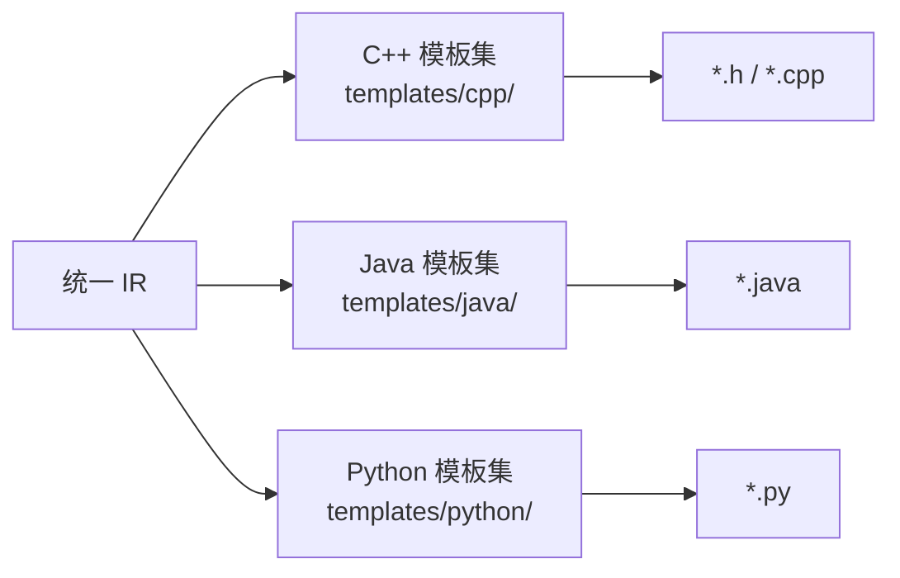

---

### 3. 用户代码保护区（Protected Region）

#### 3.1 机制设计

用户代码保护区允许用户在生成的代码中插入自定义逻辑，重新生成时不会被覆盖。

**保护区标记格式：**

```
// <user-code-begin {唯一ID}>
用户自定义代码...
// <user-code-end {唯一ID}>
```

**唯一 ID 命名规范：** `{ClassName}::{MethodName}::{位置标识}`

| 位置标识 | 用途 | 示例 |
|---------|------|------|
| `pre` | 方法体开头，初始化逻辑 | `AuthService::login::pre` |
| `post` | 方法体末尾，清理逻辑 | `AuthService::login::post` |
| `alt_{guard}_condition` | alt 条件表达式补充 | `AuthService::login::alt_userFound_condition` |
| `alt_{guard}_body` | alt 分支内用户逻辑 | `AuthService::login::alt_userFound_body` |
| `loop_{id}_body` | loop 体内用户逻辑 | `AuthService::login::loop_retry_body` |
| `public_members` | 类公有成员扩展 | `AuthService::public_members` |
| `private_members` | 类私有成员扩展 | `AuthService::private_members` |
| `includes` | 额外 include | `AuthService_h::includes` |

#### 3.2 保护区提取与回注算法

```python
import re
from typing import Dict

# 标记正则
USER_CODE_PATTERN = re.compile(
    r'// <user-code-begin ([^>]+)>\n(.*?)// <user-code-end \1>',
    re.DOTALL
)

def extract_user_code(file_content: str) -> Dict[str, str]:
    """
    从已有文件中提取所有用户代码保护区内容。
    返回: { region_id: user_code_content }
    """
    regions = {}
    for match in USER_CODE_PATTERN.finditer(file_content):
        region_id = match.group(1)
        user_code = match.group(2)
        regions[region_id] = user_code
    return regions


def inject_user_code(generated_content: str, saved_regions: Dict[str, str]) -> str:
    """
    将保存的用户代码回注到新生成的代码中。
    如果新生成的代码中存在对应的保护区ID，则替换为用户代码；
    否则保留模板生成的默认内容。
    """
    def replacer(match):
        region_id = match.group(1)
        if region_id in saved_regions:
            return (f'// <user-code-begin {region_id}>\n'
                    f'{saved_regions[region_id]}'
                    f'// <user-code-end {region_id}>')
        return match.group(0)  # 保留原样（新增的保护区）

    return USER_CODE_PATTERN.sub(replacer, generated_content)
```

#### 3.3 保护区工作流程

```mermaid
flowchart TD
    subgraph 首次生成
        G1[模板渲染] --> G2[输出含空保护区的代码文件] --> G3[用户在保护区内编辑自定义代码]
    end

    subgraph 重新生成（图修改后）
        R1[读取目标路径的现有文件] --> R2["extract_user_code()\n提取所有保护区内容"]
        R2 --> R3[模板重新渲染\n输出新的代码框架]
        R3 --> R4["inject_user_code()\n将用户代码回注"]
        R4 --> R5[写入文件]
    end

    G3 -.->|用户修改图后触发| R1
```

---

### 4. 增量式更新（基于临时旧版本比较）

#### 4.1 设计思路

通过在临时目录下保存"上一次生成的代码快照"，实现增量更新：
- 能精确识别哪些文件/方法是新增的、修改的、删除的
- 避免全量覆盖，只更新实际变化的部分
- 配合用户代码保护区，确保用户修改不丢失

#### 4.2 目录结构

```
/tmp/sysml_codegen_old/{diagram_id}/     ← 默认临时存储路径
├── AuthService.h
├── AuthService.cpp
├── Database.h
├── Database.cpp
└── .codegen_manifest.json               ← 生成清单

可自定义路径：
{user_config.oldVersionDir}/{diagram_id}/
```

**生成清单文件 `.codegen_manifest.json`：**

```json
{
  "diagramId": "uuid-xxxx",
  "generatedAt": "2026-03-24T12:30:00Z",
  "diagramHash": "sha256:abc123...",
  "files": [
    {
      "path": "AuthService.h",
      "hash": "sha256:def456...",
      "lifelines": ["AuthService"],
      "methods": ["login"]
    },
    {
      "path": "AuthService.cpp",
      "hash": "sha256:ghi789...",
      "lifelines": ["AuthService"],
      "methods": ["login"]
    }
  ]
}
```

#### 4.3 增量更新算法

```python
import hashlib
import shutil
from pathlib import Path
from typing import List, Tuple

class IncrementalUpdater:
    """
    增量更新引擎：对比 old 快照与新生成内容，只更新变化部分。
    """

    def __init__(self, diagram_id: str, output_dir: str,
                 old_version_dir: str = None):
        self.diagram_id = diagram_id
        self.output_dir = Path(output_dir)
        self.old_dir = Path(old_version_dir or f"/tmp/sysml_codegen_old/{diagram_id}")

    def update(self, new_generated_files: dict[str, str]):
        """
        new_generated_files: { "AuthService.cpp": "<新生成的内容>", ... }
        """
        old_manifest = self._load_old_manifest()
        actions = self._diff(old_manifest, new_generated_files)

        for action, filepath, content in actions:
            target = self.output_dir / filepath

            if action == "ADD":
                # 新文件，直接写入
                target.parent.mkdir(parents=True, exist_ok=True)
                target.write_text(content)

            elif action == "MODIFY":
                # 修改的文件：提取用户代码 → 回注 → 写入
                if target.exists():
                    existing_content = target.read_text()
                    user_regions = extract_user_code(existing_content)
                    content = inject_user_code(content, user_regions)
                target.write_text(content)

            elif action == "DELETE":
                # 图中已删除的生命线对应的文件
                # 不自动删除，而是标记提醒用户
                self._mark_deprecated(target)

        # 保存本次生成为新的 old 快照
        self._save_snapshot(new_generated_files)

    def _diff(self, old_manifest, new_files) -> List[Tuple[str, str, str]]:
        """
        对比新旧版本，返回 [(action, filepath, content), ...]
        action: ADD | MODIFY | DELETE | UNCHANGED
        """
        actions = []
        old_files = {f["path"]: f["hash"] for f in old_manifest.get("files", [])}

        for filepath, content in new_files.items():
            new_hash = hashlib.sha256(content.encode()).hexdigest()
            if filepath not in old_files:
                actions.append(("ADD", filepath, content))
            elif old_files[filepath] != new_hash:
                actions.append(("MODIFY", filepath, content))
            # UNCHANGED: 不处理

        # 检测删除的文件
        for old_path in old_files:
            if old_path not in new_files:
                actions.append(("DELETE", old_path, ""))

        return actions

    def _save_snapshot(self, generated_files: dict[str, str]):
        """将本次生成结果保存为 old 快照，供下次增量对比使用。"""
        # 清空旧快照
        if self.old_dir.exists():
            shutil.rmtree(self.old_dir)
        self.old_dir.mkdir(parents=True, exist_ok=True)

        manifest = {
            "diagramId": self.diagram_id,
            "generatedAt": datetime.now().isoformat(),
            "files": []
        }

        for filepath, content in generated_files.items():
            # 保存文件副本
            dest = self.old_dir / filepath
            dest.parent.mkdir(parents=True, exist_ok=True)
            dest.write_text(content)

            manifest["files"].append({
                "path": filepath,
                "hash": hashlib.sha256(content.encode()).hexdigest()
            })

        # 保存清单
        manifest_path = self.old_dir / ".codegen_manifest.json"
        manifest_path.write_text(json.dumps(manifest, indent=2))

    def _mark_deprecated(self, filepath: Path):
        """在文件头部插入废弃警告，而非直接删除。"""
        if filepath.exists():
            content = filepath.read_text()
            warning = ("// [WARNING] 此文件对应的生命线已从顺序图中删除。\n"
                       "// 请确认后手动删除此文件。\n"
                       f"// 标记时间: {datetime.now().isoformat()}\n\n")
            filepath.write_text(warning + content)
```

#### 4.4 增量更新流程图

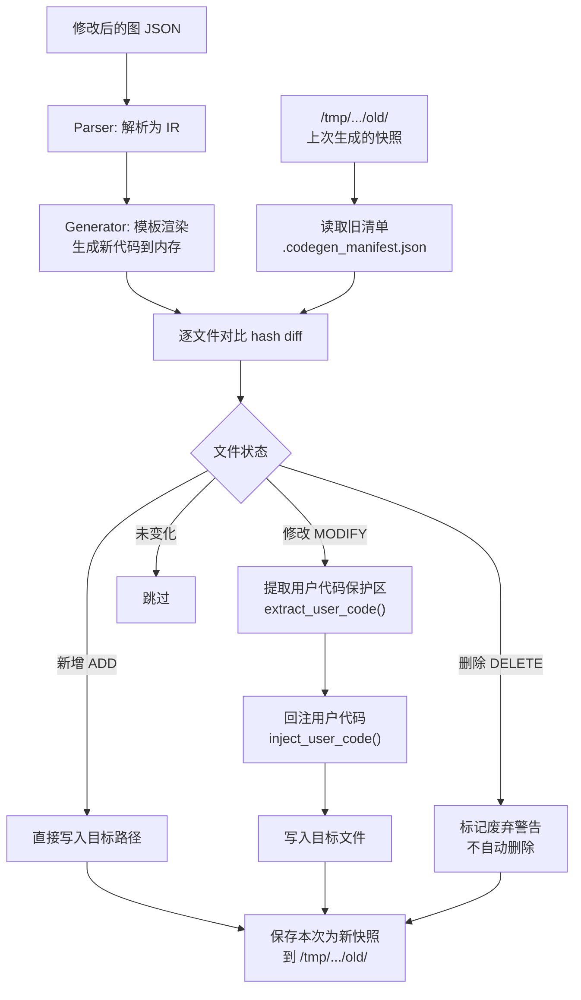

---

### 5. 代码生成路径配置与图绑定

#### 5.1 设计目标

每张顺序图可独立配置代码生成的目标路径、目标语言和模板集，实现：
- 同一项目中不同图生成到不同目录
- 图与生成路径持久绑定，重新打开时自动关联
- 支持相对路径和绝对路径

#### 5.2 配置数据结构

配置直接嵌入图的 JSON 持久化文件中（见第一部分 1.2 节 `metadata.codeGenConfig`）：

```jsonc
{
  "metadata": {
    "id": "uuid-xxxx",
    "name": "登录认证顺序图",
    "codeGenConfig": {
      // 生成代码的输出目录（相对于图文件所在目录，或绝对路径）
      "outputDir": "./generated/login_auth",

      // 目标语言
      "language": "cpp",      // cpp | java | python

      // 模板集名称（支持自定义模板集）
      "templateSet": "default",

      // 旧版本快照存储路径（可选，默认 /tmp）
      "oldVersionDir": null,  // null 时使用 /tmp/sysml_codegen_old/{id}

      // 命名空间（可选）
      "namespace": "auth",

      // 每个生命线的独立配置（可选，覆盖全局设置）
      "lifelineOverrides": {
        "ll-003": {
          "outputDir": "./generated/persistence",
          "namespace": "persistence"
        }
      }
    }
  }
}
```

#### 5.3 路径解析逻辑

```python
from pathlib import Path

class OutputPathResolver:
    """解析代码生成的输出路径。"""

    def __init__(self, diagram_file_path: str, config: dict):
        self.diagram_dir = Path(diagram_file_path).parent
        self.config = config

    def resolve_output_dir(self, lifeline_id: str = None) -> Path:
        """
        解析输出目录。优先级：
        1. 生命线独立配置
        2. 图全局配置
        3. 默认（图文件同目录下的 generated/）
        """
        overrides = self.config.get("lifelineOverrides", {})
        if lifeline_id and lifeline_id in overrides:
            raw_path = overrides[lifeline_id].get("outputDir")
        else:
            raw_path = self.config.get("outputDir", "./generated")

        path = Path(raw_path)
        if not path.is_absolute():
            path = self.diagram_dir / path

        return path.resolve()

    def resolve_old_version_dir(self, diagram_id: str) -> Path:
        """解析旧版本快照目录。"""
        custom = self.config.get("oldVersionDir")
        if custom:
            return Path(custom) / diagram_id
        return Path(f"/tmp/sysml_codegen_old/{diagram_id}")
```

**路径解析优先级：**

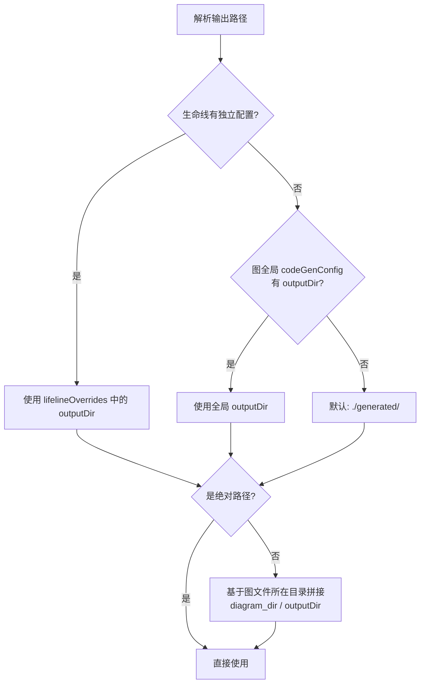

#### 5.4 UI 上的路径配置

在右侧属性面板中（见界面设计 `CodeGenConfig.vue`），用户可以配置：

- **输出路径**：文本输入 + 文件夹选择按钮
- **目标语言**：下拉选择 (C++ / Java / Python)
- **模板集**：下拉选择 (default / 自定义)
- **命名空间**：文本输入
- **旧版本路径**：文本输入 + 文件夹选择按钮（默认 /tmp）
- **生命线独立配置**：勾选启用，为特定生命线设置独立输出目录
- **操作按钮**：[生成代码] [预览]

#### 5.5 完整的代码生成触发流程

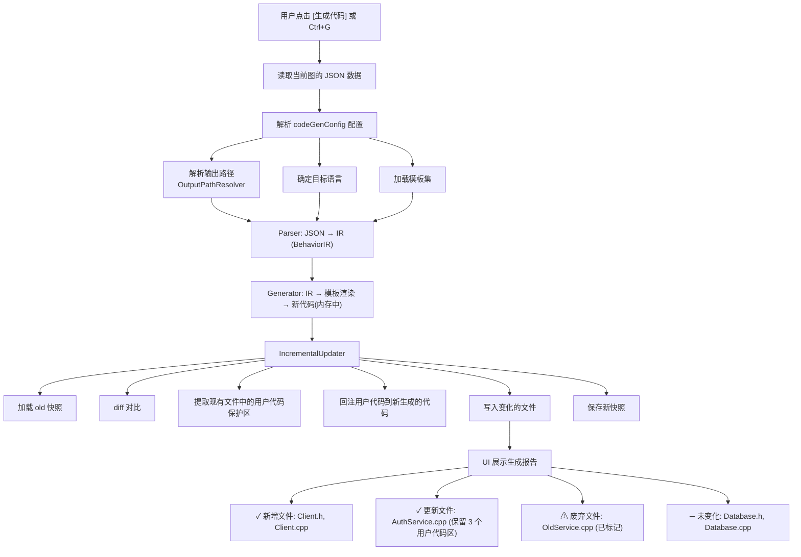

---

## 附录：IR（中间表示）完整数据结构

```python
from dataclasses import dataclass, field
from typing import List, Optional
from enum import Enum

class MessageType(Enum):
    SYNC = "sync"
    ASYNC = "async"
    RETURN = "return"
    CREATE = "create"
    DESTROY = "destroy"

@dataclass
class Parameter:
    name: str
    type: str

@dataclass
class Lifeline:
    id: str
    name: str
    stereotype: str = ""
    namespace: str = ""

@dataclass
class Statement:
    """语句基类"""
    pass

@dataclass
class CallStatement(Statement):
    source: str            # 调用者生命线名
    target: str            # 被调用者生命线名
    method_name: str
    arguments: List[Parameter] = field(default_factory=list)
    return_type: str = "void"
    message_type: MessageType = MessageType.SYNC

@dataclass
class IfStatement(Statement):
    condition: str
    then_statements: List[Statement] = field(default_factory=list)
    else_statements: List[Statement] = field(default_factory=list)

@dataclass
class LoopStatement(Statement):
    condition: str
    body_statements: List[Statement] = field(default_factory=list)

@dataclass
class OptStatement(Statement):
    condition: str
    body_statements: List[Statement] = field(default_factory=list)

@dataclass
class ReturnStatement(Statement):
    value: str
    return_type: str

@dataclass
class MethodModel:
    name: str
    params: List[Parameter]
    return_type: str
    body: List[Statement] = field(default_factory=list)

@dataclass
class ClassModel:
    name: str
    lifeline_id: str
    namespace: str = ""
    stereotype: str = ""
    methods: List[MethodModel] = field(default_factory=list)
    dependencies: List[str] = field(default_factory=list)  # 依赖的其他类名

@dataclass
class BehaviorIR:
    """完整的行为中间表示，由 Parser 输出，供 Generator 消费。"""
    classes: List[ClassModel] = field(default_factory=list)
    diagram_id: str = ""
    diagram_name: str = ""
```

**IR 类关系图：**

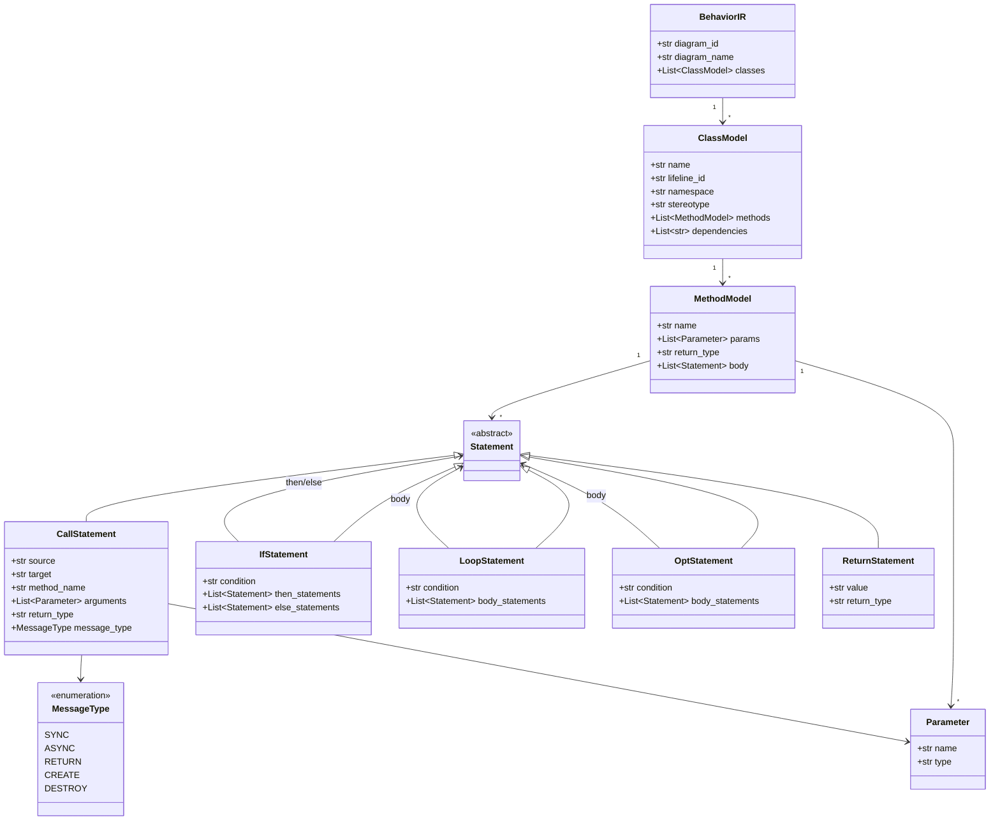
