# SysML/UML 顺序图 (Sequence Diagram) 完整技术研究报告

> 参考标准: UML 2.5.1 (OMG formal/2017-12-05), XMI 2.5.1, SysML 1.6
> 编写目的: 为基于顺序图的代码生成项目提供全面的技术参考

---

## 第一部分：顺序图所有元素/组件 (Exhaustive Element Reference)

---

### 1.1 Interaction (交互)

**形式定义**: Interaction 是 Behavior 的子类, 定义了一组 Lifeline 之间通过 Message 交换进行通信的行为模式。它是顺序图的顶层容器元素。

**可视化表示**: 使用矩形框架(frame), 左上角有一个五角形标签(pentagon/namebox), 标签格式为 `sd InteractionName`。

**属性/Properties**:
| 属性 | 类型 | 说明 |
|------|------|------|
| name | String | 交互名称 |
| lifeline | Lifeline [*] | 参与交互的所有生命线 (Subsets Namespace::ownedMember) |
| message | Message [*] | 交互中的所有消息 (Subsets Namespace::ownedMember) |
| fragment | InteractionFragment [*] | 交互中的所有片段, 有序集合 (Subsets Namespace::ownedMember) |
| formalGate | Gate [*] | 交互的形式门 |
| action | Action [*] | 交互拥有的动作 |

**约束/Constraints**:
- Interaction 必须是顶层命名空间或嵌套在 Class/Component 中
- 所有 Message 的端点必须是该 Interaction 拥有的 Lifeline 上的 OccurrenceSpecification

**XMI 表示**:
```xml
<packagedElement xmi:type="uml:Collaboration" xmi:id="EAID_COL_001" name="Collab1">
  <ownedBehavior xmi:type="uml:Interaction" xmi:id="EAID_INT_001" name="LoginSequence">
    <!-- lifelines, fragments, messages go here -->
  </ownedBehavior>
</packagedElement>
```
注: 在某些工具(如 Papyrus)中, Interaction 直接作为 packagedElement:
```xml
<packagedElement xmi:type="uml:Interaction" xmi:id="_INT001" name="LoginSequence">
  ...
</packagedElement>
```

---

### 1.2 Lifeline (生命线)

**形式定义**: Lifeline 是一个命名元素(NamedElement), 代表交互中的一个独立参与者。即使被引用的 ConnectableElement 具有大于1的多重性, 每个 Lifeline 也仅描述一个交互实体。

**可视化表示**: 由一个矩形"头部"(head)和一条从头部向下延伸的垂直虚线(dashed vertical line)组成。虚线代表参与者的生存期。

**命名语法**:
```
lifeline-ident ::= [ connectable-element-name [ '[' selector ']' ] ] [ ':' class-name ] [ decomposition ] | 'self'
```

示例:
- `myObj : MyClass` — 具名实例
- `: MyClass` — 匿名实例
- `self` — 表示封闭分类器自身的对象
- `myList[k]` — 带选择器的多重性实例

**Mermaid 示例**:
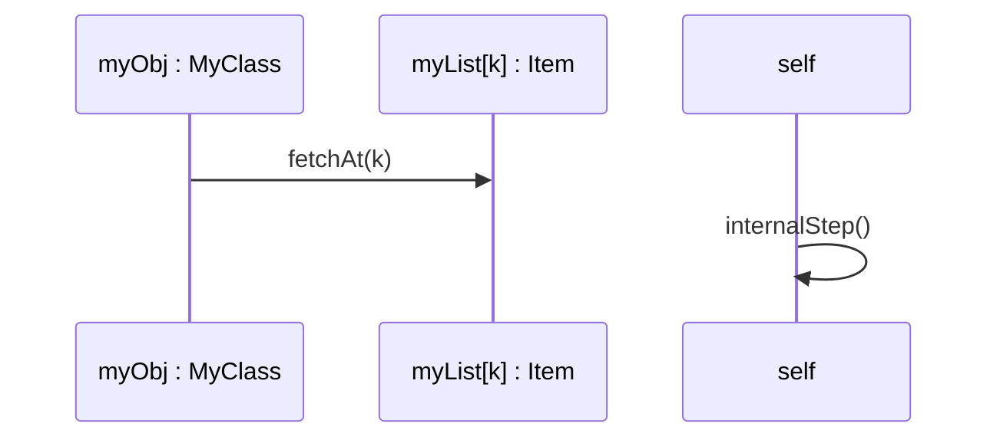
```mermaid
sequenceDiagram
    participant myObj as myObj : MyClass
    participant myList as myList[k] : Item
    participant self as self

    myObj->>myList: fetchAt(k)
    self->>self: internalStep()
```

**属性/Properties**:
| 属性 | 类型 | 说明 |
|------|------|------|
| name | String | 生命线名称 |
| represents | ConnectableElement [0..1] | 该生命线代表的可连接元素(属性、端口、参数) |
| selector | ValueSpecification [0..1] | 多重性 > 1 时的选择器表达式 |
| decomposedAs | PartDecomposition [0..1] | 指向该生命线的分解引用 |
| coveredBy | InteractionFragment [*] | 覆盖此生命线的所有交互片段 |

**约束/Constraints**:
- 如果 selector 存在, represents 的多重性必须 > 1
- 如果省略 selector 且多重性 > 1, 则选择任意代表
- 使用 `self` 时不能有 represents
- 头部形状可以基于分类器的符号(如 actor 用小人图标)

**XMI 表示**:
```xml
<lifeline xmi:type="uml:Lifeline" xmi:id="EAID_LL_001"
          name="client" visibility="public" represents="EAID_PROP_001"/>
```

---

### 1.3 Message (消息)

**形式定义**: Message 是一个命名元素(NamedElement), 定义了交互中 Lifeline 之间的一种特定通信。它指定了发送者和接收者, 以及通信的类型(调用、信号、创建、删除、回复等)。

**可视化表示**: 用从发送者到接收者的线(arrow line)表示。

**签名语法 (Message Signature Syntax)**:
```
message ::= [ attribute '=' ] signal-or-operation-name [ arguments ] [ ':' return-value ]
arguments ::= '(' [ argument [ ',' argument ]* ] ')'
```

**属性/Properties**:
| 属性 | 类型 | 说明 |
|------|------|------|
| name | String | 消息名称(通常是操作名或信号名) |
| messageSort | MessageSort | 消息类型枚举 |
| messageKind | MessageKind | 消息完整性(complete, lost, found, unknown) |
| sendEvent | MessageEnd [0..1] | 发送事件(OccurrenceSpecification) |
| receiveEvent | MessageEnd [0..1] | 接收事件(OccurrenceSpecification) |
| connector | Connector [0..1] | 消息传输的连接器 |
| interaction | Interaction [1] | 所属交互 |
| argument | ValueSpecification [*] | 消息参数值 |
| signature | NamedElement [0..1] | 引用的操作(Operation)或信号(Signal) |

#### MessageSort 枚举 (消息排序类型)

| 枚举值 | 中文 | 说明 |
|--------|------|------|
| **synchCall** | 同步调用 | 同步操作调用, 发送者挂起等待响应 |
| **asynchCall** | 异步调用 | 异步操作调用, 发送者立即继续 |
| **asynchSignal** | 异步信号 | 对应发送信号动作(SendSignalAction) |
| **reply** | 回复 | 对操作调用的回复消息 |
| **createMessage** | 创建消息 | 创建新实例的消息 |
| **deleteMessage** | 删除/销毁消息 | 销毁实例的消息 |

#### MessageKind 枚举 (消息完整性)

| 枚举值 | 中文 | 说明 |
|--------|------|------|
| **complete** | 完整 | 发送事件和接收事件都已知 |
| **lost** | 丢失 | 发送事件已知, 接收事件未知(消息未到达目的地) |
| **found** | 发现 | 接收事件已知, 发送事件未知(未知来源发送) |
| **unknown** | 未知 | 发送和接收事件都未知 |

**XMI 表示**:
```xml
<message xmi:type="uml:Message" xmi:id="EAID_MSG_001"
         name="login" messageSort="synchCall"
         sendEvent="EAID_MOS_001" receiveEvent="EAID_MOS_002"/>

<message xmi:type="uml:Message" xmi:id="EAID_MSG_002"
         name="result" messageSort="reply"
         sendEvent="EAID_MOS_003" receiveEvent="EAID_MOS_004"/>
```

---

### 1.4 Message 类型详解 (Message Types Deep Dive)

#### 1.4.1 同步消息 (Synchronous Message)

- **箭头表示**: 实线 + 实心箭头 (solid line with filled/solid arrowhead ▶)
- **messageSort**: `synchCall`
- **语义**: 发送者调用操作并挂起(阻塞), 等待接收者处理完毕并返回
- **通常配对**: 后续有一个 reply 消息返回
- **标签语法**: `operationName(param1, param2) : returnType`
- **示例**: `login(username, password) : bool`

**Mermaid 示例**:
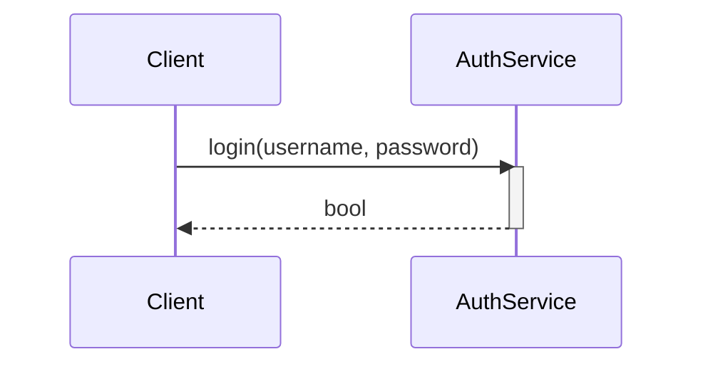
```mermaid
sequenceDiagram
    participant Client
    participant AuthService

    Client->>AuthService: login(username, password)
    activate AuthService
    AuthService-->>Client: bool
    deactivate AuthService
```

#### 1.4.2 异步消息 (Asynchronous Message)

- **箭头表示**: 实线 + 开放箭头 (solid line with open/stick arrowhead ▷)
- **messageSort**: `asynchCall` 或 `asynchSignal`
- **语义**: 发送者发送消息后立即继续执行(非阻塞), 不等待返回值
- **标签语法**: `signalOrOperationName(param1)`
- **asynchCall vs asynchSignal**: asynchCall 对应异步操作调用; asynchSignal 对应发送信号

**Mermaid 示例**:
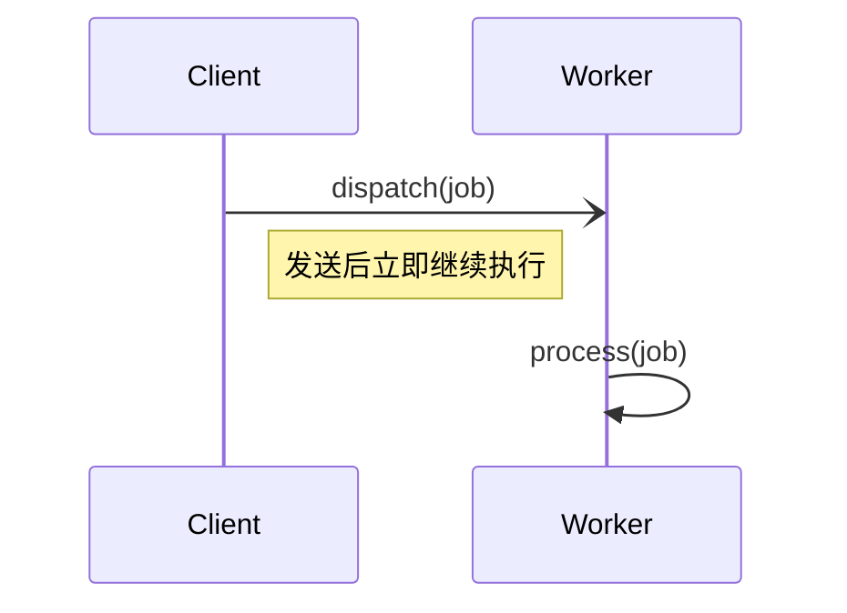
```mermaid
sequenceDiagram
    participant Client
    participant Worker

    Client-)Worker: dispatch(job)
    Note right of Client: 发送后立即继续执行
    Worker->>Worker: process(job)
```

#### 1.4.3 回复消息 (Reply Message)

- **箭头表示**: 虚线 + 开放箭头 (dashed line with open arrowhead ▷)
- **messageSort**: `reply`
- **语义**: 对先前同步调用的返回, 携带返回值
- **标签语法**: `operationName(returnValue)` 或 `assignVar = operationName(returnValue)`
- **注**: 回复消息是可选的——有些图省略回复以减少视觉复杂度, 返回值被隐含

**Mermaid 示例**:
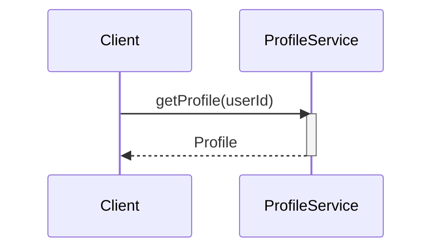
```mermaid
sequenceDiagram
    participant Client
    participant ProfileService

    Client->>ProfileService: getProfile(userId)
    activate ProfileService
    ProfileService-->>Client: Profile
    deactivate ProfileService
```

#### 1.4.4 创建消息 (Create Message)

- **箭头表示**: 虚线 + 开放箭头 (dashed line with open arrowhead ▷), 箭头指向被创建生命线的头部
- **messageSort**: `createMessage`
- **语义**: 在交互过程中创建一个新的对象实例
- **特殊规则**: 被创建的 Lifeline 的头部矩形位置低于其他 Lifeline(在创建消息到达的位置)
- **标签语法**: 通常标注 `<<create>>` 或 构造函数名

**Mermaid 示例**:
```mermaid
sequenceDiagram
    participant Client
    participant Factory
    create participant Product

    Client->>Factory: create()
    Factory->>Product: <<create>>
    Product-->>Factory: initDone
    Factory-->>Client: product
```

#### 1.4.5 删除/销毁消息 (Delete/Destroy Message)

- **箭头表示**: 实线 + 实心箭头, 在接收端生命线底部标记 X 符号 (DestructionOccurrenceSpecification)
- **messageSort**: `deleteMessage`
- **语义**: 销毁接收对象, 该生命线在 X 符号之后不再存在
- **特殊规则**: X 之后不能有任何 OccurrenceSpecification

**Mermaid 示例**:
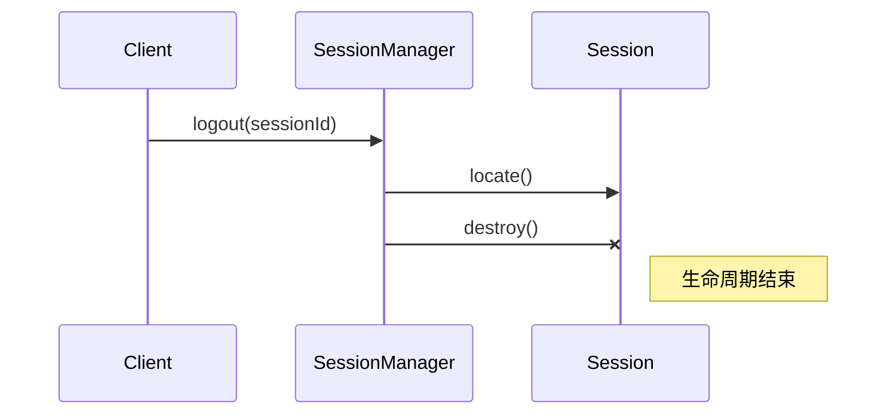
```mermaid
sequenceDiagram
    participant Client
    participant SessionManager
    participant Session

    Client->>SessionManager: logout(sessionId)
    SessionManager->>Session: locate()
    SessionManager-xSession: destroy()
    Note right of Session: 生命周期结束
```

#### 1.4.6 发现消息 (Found Message)

- **箭头表示**: 箭头从一个小实心圆开始, 指向接收者生命线
- **messageKind**: `found`
- **语义**: 消息来自未知或未指定的发送者, 仅接收事件已知
- **用途**: 表示外部系统或之前交互发来的消息

**Mermaid 示例**:
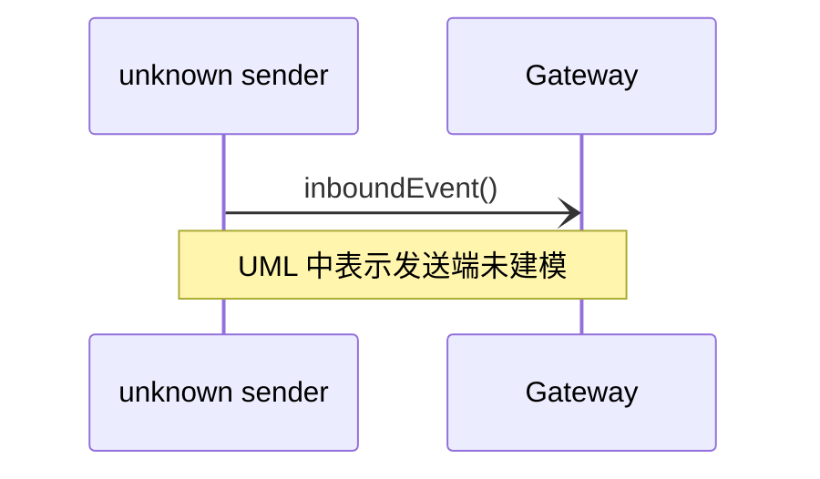
```mermaid
sequenceDiagram
    participant Unknown as unknown sender
    participant Gateway

    Unknown-)Gateway: inboundEvent()
    Note over Unknown,Gateway: UML 中表示发送端未建模
```

#### 1.4.7 丢失消息 (Lost Message)

- **箭头表示**: 从发送者生命线出发的箭头, 终止于一个小实心圆
- **messageKind**: `lost`
- **语义**: 消息发出但未到达目的地, 仅发送事件已知
- **用途**: 表示消息丢失或发往未知/未指定的接收者

**Mermaid 示例**:
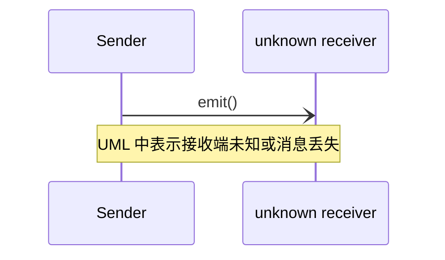
```mermaid
sequenceDiagram
    participant Sender
    participant Unknown as unknown receiver

    Sender-)Unknown: emit()
    Note over Sender,Unknown: UML 中表示接收端未知或消息丢失
```

#### 1.4.8 自身消息 (Self Message)

- **箭头表示**: U 形箭头, 从同一生命线出发并返回同一生命线
- **语义**: 对象调用自身的操作, 导致在同一生命线上产生嵌套的执行规约
- **视觉效果**: 显示为叠加的执行规约矩形

**Mermaid 示例**:
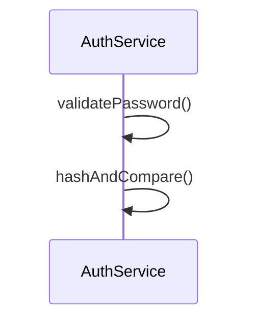
```mermaid
sequenceDiagram
    participant AuthService

    AuthService->>AuthService: validatePassword()
    AuthService->>AuthService: hashAndCompare()
```

---

### 1.5 MessageOccurrenceSpecification (消息出现规约)

**形式定义**: MessageOccurrenceSpecification 是 OccurrenceSpecification 的子类, 专门代表消息的发送或接收事件。它是 Message 和 OccurrenceSpecification 的交汇点。

**属性/Properties**:
| 属性 | 类型 | 说明 |
|------|------|------|
| message | Message [1] | 关联的消息 |
| covered | Lifeline [1] | 覆盖的生命线(继承自 OccurrenceSpecification) |

**约束**:
- 每个 MessageOccurrenceSpecification 恰好覆盖一个 Lifeline
- 作为 sendEvent 时, 对应消息发送; 作为 receiveEvent 时, 对应消息接收
- 在生命线上按时间排序

**XMI 表示**:
```xml
<fragment xmi:type="uml:MessageOccurrenceSpecification"
          xmi:id="EAID_MOS_001" name="MOS_login_send" covered="EAID_LL_001"/>
<fragment xmi:type="uml:MessageOccurrenceSpecification"
          xmi:id="EAID_MOS_002" name="MOS_login_recv" covered="EAID_LL_002"/>
```

---

### 1.6 ExecutionSpecification (执行规约)

**形式定义**: ExecutionSpecification 是一个 InteractionFragment, 表示生命线上参与者执行行为单元的时期——包括执行行为/动作、发送信号、或等待回复消息。

**持续时间**: 由两个 ExecutionOccurrenceSpecification 界定——start(开始)和 finish(结束)。

**可视化表示**: 在生命线上用细长的灰色或白色矩形表示。也可用更宽的带标签矩形(标签标识执行的动作)。

**属性/Properties**:
| 属性 | 类型 | 说明 |
|------|------|------|
| start | OccurrenceSpecification [1] | 执行开始事件 |
| finish | OccurrenceSpecification [1] | 执行结束事件 |

#### 1.6.1 BehaviorExecutionSpecification (行为执行规约)

**形式定义**: BehaviorExecutionSpecification 是 ExecutionSpecification 的子类, 代表一个 Behavior 的执行。

**属性**:
| 属性 | 类型 | 说明 |
|------|------|------|
| behavior | Behavior [0..1] | 关联的行为(如 OpaqueBehavior, Activity 等) |

#### 1.6.2 ActionExecutionSpecification (动作执行规约)

**形式定义**: ActionExecutionSpecification 是 ExecutionSpecification 的子类, 代表一个 Action 的执行。

**属性**:
| 属性 | 类型 | 说明 |
|------|------|------|
| action | Action [1] | 关联的动作, 必须由拥有该 ActionExecutionSpecification 的 Interaction 拥有 |

**约束**: action 必须是包含此 ActionExecutionSpecification 的 Interaction 所拥有的 Action。

**XMI 表示**:
```xml
<fragment xmi:type="uml:BehaviorExecutionSpecification"
          xmi:id="EAID_BES_001" name="BES_1"
          start="EAID_EOS_001" finish="EAID_EOS_002" covered="EAID_LL_002"/>
```

**用户图示示例（原图 + Mermaid 近似复现）**:

下图同时体现了 `found/external` 入口消息、左侧长执行规约、右侧多段短执行规约，以及中途一条 reply 消息:

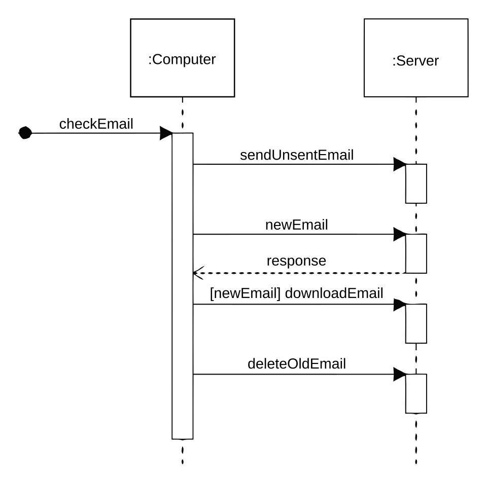

对应的 Mermaid 近似写法如下:

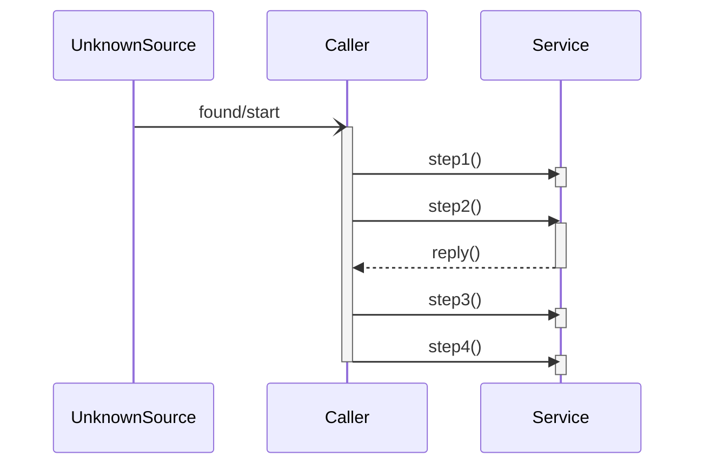
```mermaid
sequenceDiagram
    participant External as UnknownSource
    participant Caller
    participant Service

    External-)Caller: found/start
    activate Caller

    Caller->>Service: step1()
    activate Service
    deactivate Service

    Caller->>Service: step2()
    activate Service
    Service-->>Caller: reply()
    deactivate Service

    Caller->>Service: step3()
    activate Service
    deactivate Service

    Caller->>Service: step4()
    activate Service
    deactivate Service

    deactivate Caller
```

**Mermaid 能力边界**:
- 可以表达: 两条主生命线、入口消息的近似表示、长/短执行规约、多条普通消息、reply
- 不能完全复刻: UML found message 左侧黑色实心圆起点、activation bar 的像素级尺寸/位置、与原图完全一致的几何布局

---

### 1.7 OccurrenceSpecification (出现规约)

**形式定义**: OccurrenceSpecification 是 InteractionFragment 的子类, 表示交互中的一个时间点(事件)。它出现在消息的开始/结束或执行的开始/结束处。

**可视化表示**: 无独立的图形符号——它在图中表现为消息箭头与生命线的交点。

**属性/Properties**:
| 属性 | 类型 | 说明 |
|------|------|------|
| covered | Lifeline [1] | 覆盖的生命线(恰好一个) |
| toAfter | GeneralOrdering [*] | 此出现之后的排序关系 |
| toBefore | GeneralOrdering [*] | 此出现之前的排序关系 |

---

### 1.8 ExecutionOccurrenceSpecification (执行出现规约)

**形式定义**: ExecutionOccurrenceSpecification 是 OccurrenceSpecification 的子类, 代表执行规约的开始或结束事件。

**属性**:
| 属性 | 类型 | 说明 |
|------|------|------|
| execution | ExecutionSpecification [1] | 关联的执行规约 |

**XMI 表示**:
```xml
<fragment xmi:type="uml:ExecutionOccurrenceSpecification"
          xmi:id="EAID_EOS_001" name="EOS_start" covered="EAID_LL_002"
          execution="EAID_BES_001"/>
```

---

### 1.9 DestructionOccurrenceSpecification (销毁出现规约)

**形式定义**: DestructionOccurrenceSpecification 是 MessageOccurrenceSpecification 的子类, 表示生命线描述的实例被销毁的时刻。

**可视化表示**: 在生命线底部用 X 符号 (cross) 表示。

**约束**: 该生命线上不能在 DestructionOccurrenceSpecification 之后出现任何其他 OccurrenceSpecification。

**XMI 表示**:
```xml
<fragment xmi:type="uml:DestructionOccurrenceSpecification"
          xmi:id="EAID_DOS_001" name="DOS_destroy" covered="EAID_LL_003"/>
```

---

### 1.10 CombinedFragment (组合片段)

**形式定义**: CombinedFragment 是 InteractionFragment 的子类, 定义了交互片段的组合(表达式)。它由一个 InteractionOperator 和一个或多个 InteractionOperand 组成。

**可视化表示**: 实线矩形框, 左上角五角形区域显示操作符关键字(如 alt, loop, opt 等)。操作数之间用水平虚线分隔。

**属性/Properties**:
| 属性 | 类型 | 说明 |
|------|------|------|
| interactionOperator | InteractionOperatorKind | 操作符类型 (默认值: seq) |
| operand | InteractionOperand [1..*] | 操作数集合 (Subsets Element::ownedElement) |
| cfragmentGate | Gate [*] | 组合片段的门 |

**约束/Constraints**:
1. 操作符为 opt, loop, break, neg 时, 必须恰好有一个操作数
2. InteractionConstraint 的 minint/maxint 仅适用于 loop 操作符的操作数
3. break 操作符的操作数必须覆盖封闭 InteractionFragment 的所有 Lifeline
4. consider/ignore 操作符仅允许在 ConsiderIgnoreFragment 子类型中使用

**XMI 表示**:
```xml
<fragment xmi:type="uml:CombinedFragment" xmi:id="EAID_CF_001"
          name="alt_fragment" interactionOperator="alt">
  <operand xmi:type="uml:InteractionOperand" xmi:id="EAID_IO_001">
    <guard xmi:type="uml:InteractionConstraint" xmi:id="EAID_IC_001">
      <specification xmi:type="uml:LiteralString" value="[isValid]"/>
    </guard>
    <!-- fragments inside this operand -->
  </operand>
  <operand xmi:type="uml:InteractionOperand" xmi:id="EAID_IO_002">
    <guard xmi:type="uml:InteractionConstraint" xmi:id="EAID_IC_002">
      <specification xmi:type="uml:LiteralString" value="[else]"/>
    </guard>
    <!-- fragments inside this operand -->
  </operand>
</fragment>
```

---

### 1.11 InteractionOperand (交互操作数)

**形式定义**: InteractionOperand 是 InteractionFragment 的子类和 Namespace 的子类, 代表 CombinedFragment 中的一个操作数。它包含一个可选的守卫条件(guard)和一组有序的交互片段。

**可视化表示**: CombinedFragment 矩形内的一个区域, 与其他操作数之间用水平虚线分隔。守卫条件显示在操作数区域的顶部, 用方括号表示。

**属性/Properties**:
| 属性 | 类型 | 说明 |
|------|------|------|
| guard | InteractionConstraint [0..1] | 守卫条件 |
| fragment | InteractionFragment [*] | 操作数内的有序片段集合 |

---

### 1.12 InteractionConstraint (交互约束 / 守卫条件)

**形式定义**: InteractionConstraint 是 Constraint 的子类, 作为 CombinedFragment 的 InteractionOperand 的守卫条件(guard)。它是一个布尔值表达式。

**可视化表示**: 在操作数区域顶部, 方括号内的布尔表达式, 如 `[x > 0]`, `[isValid]`, `[else]`。

**属性/Properties**:
| 属性 | 类型 | 说明 |
|------|------|------|
| specification | ValueSpecification [1] | 约束的布尔表达式 |
| minint | ValueSpecification [0..1] | loop 的最小迭代次数 |
| maxint | ValueSpecification [0..1] | loop 的最大迭代次数 |

**约束**:
- minint/maxint 仅在关联的 CombinedFragment 操作符为 loop 时有意义
- minint 必须 >= 0
- maxint 必须 >= minint
- 如果 guard 为空或缺失, 隐含为 true

---

### 1.13 InteractionUse (交互使用 / ref)

**形式定义**: InteractionUse 是 InteractionFragment 的子类, 允许在当前交互中引用(调用)另一个交互。用于简化大型复杂顺序图。

**机制**:
- 将被引用交互的内容"复制"到引用处
- 用实际参数替换形式参数
- 将形式门连接到实际门

**可视化表示**: 显示为带有 `ref` 操作符的组合片段框。

**语法**:
```
interaction-use ::= [ attribute-name '=' ] [ collaboration-use '.' ] interaction-name
                    [ io-arguments ] [ ':' return-value ]
io-arguments ::= '(' io-argument [ ',' io-argument ]* ')'
```

**属性/Properties**:
| 属性 | 类型 | 说明 |
|------|------|------|
| refersTo | Interaction [1] | 被引用的交互 |
| argument | ValueSpecification [*] | 传递的实际参数 |
| returnValue | ValueSpecification [0..1] | 返回值 |
| actualGate | Gate [*] | 实际门 |
| returnValueRecipient | Property [0..1] | 接收返回值的属性 |

**约束**: InteractionUse 必须覆盖被引用交互中涉及的所有生命线。

**XMI 表示**:
```xml
<fragment xmi:type="uml:InteractionUse" xmi:id="EAID_IU_001"
          name="AuthProcess" refersTo="EAID_INT_002">
  <argument xmi:type="uml:LiteralString" value="token123"/>
</fragment>
```

---

### 1.14 Gate (门)

**形式定义**: Gate 是一个 MessageEnd, 用作连接交互片段外部消息与内部消息的连接点。它的作用是为每个消息指定具体的发送者和接收者。

**类型**:
| 类型 | 说明 |
|------|------|
| Formal Gate (形式门) | 在 Interaction 上定义 |
| Actual Gate (实际门) | 在 InteractionUse 上定义 |
| Expression Gate (表达式门) | 在 CombinedFragment 上定义 |

**命名规则**: 隐式名称由方向和消息名称拼接, 如 `in_search`, `out_read`。

**可视化表示**: 在交互框架边界上的一个点, 消息箭头穿过框架边界。

**XMI 表示**:
```xml
<formalGate xmi:type="uml:Gate" xmi:id="EAID_G_001" name="in_request"/>
```

---

### 1.15 StateInvariant (状态不变量)

**形式定义**: StateInvariant 是 InteractionFragment 的子类, 表示对交互参与者的运行时约束, 可以指定属性值、变量值、内部/外部状态等。

**评估时机**: 在下一个 OccurrenceSpecification 执行之前立即评估, 此时所有未显式建模的动作都已执行。

**可视化表示**:
1. 在生命线上用花括号表示约束: `{balance > 0}`
2. 用状态符号(圆角矩形)表示状态: 在生命线上画状态框
3. 用注释(note)关联到 OccurrenceSpecification

**属性/Properties**:
| 属性 | 类型 | 说明 |
|------|------|------|
| invariant | Constraint [1] | 不变量约束表达式 |
| covered | Lifeline [1] | 覆盖的生命线(恰好一个) |

**XMI 表示**:
```xml
<fragment xmi:type="uml:StateInvariant" xmi:id="EAID_SI_001" covered="EAID_LL_001">
  <invariant xmi:type="uml:Constraint" xmi:id="EAID_C_001">
    <specification xmi:type="uml:LiteralString" value="{isLoggedIn == true}"/>
  </invariant>
</fragment>
```

---

### 1.16 GeneralOrdering (一般排序)

**形式定义**: GeneralOrdering 是 NamedElement 的子类, 定义了两个 OccurrenceSpecification 之间的二元关系, 表示一个出现必须在另一个之前发生。

**可视化表示**: 在两个 OccurrenceSpecification 之间画一条带箭头的线(dashed line with arrowhead), 从先发生的事件指向后发生的事件。在大多数顺序图中, 时间的自上而下顺序已经隐含了排序, GeneralOrdering 主要用于跨不同生命线的出现需要显式指定排序时。

**属性/Properties**:
| 属性 | 类型 | 说明 |
|------|------|------|
| before | OccurrenceSpecification [1] | 必须先发生的出现 |
| after | OccurrenceSpecification [1] | 必须后发生的出现 |

**约束**: before 和 after 不能是同一个 OccurrenceSpecification。

---

### 1.17 PartDecomposition (部分分解)

**形式定义**: PartDecomposition 是 InteractionUse 的子类, 用于将一个 Lifeline 分解为更详细的子组件交互。它引用另一个 Interaction, 该 Interaction 描述了该 Lifeline 代表的部件内部的详细交互。

**可视化表示**: 在被分解的 Lifeline 的头部矩形中添加 `ref` 标签, 如 `ref: DetailedInteraction`。然后在单独的图中展示分解后的多个子生命线。

**属性**:
| 属性 | 类型 | 说明 |
|------|------|------|
| refersTo | Interaction [1] | 分解引用的详细交互(继承自 InteractionUse) |

**约束**:
- PartDecomposition 所引用的 Interaction 中的 Lifeline 必须对应被分解 Lifeline 代表的部件的内部结构
- 进入和离开被分解 Lifeline 的消息必须与分解交互的门匹配

---

### 1.18 Continuation (延续)

**形式定义**: Continuation 是 InteractionFragment 的子类, 用于在 CombinedFragment 的不同 InteractionOperand 之间建立连续性。与 StateInvariant 使用相同的符号, 但可以跨越多个 Lifeline。

**可视化表示**: 与状态不变量类似的圆角矩形, 但可以横跨多个生命线, 内部写有名称标签。

**规则**:
- 如果 Continuation 在交互片段的开头, 表示从具有相同名称的前一个 Continuation 结尾处继续
- 如果在交互片段的末尾, 则表示后续必须有一个同名的 Continuation 来接续
- 必须在 CombinedFragment 的 InteractionOperand 中使用
- 主要与 alt 操作符配合使用

**属性/Properties**:
| 属性 | 类型 | 说明 |
|------|------|------|
| name | String | 延续名称(用于匹配) |
| setting | Boolean | true = 末尾(设置); false = 开头(匹配) |
| covered | Lifeline [*] | 覆盖的生命线集合 |

---

### 1.19 InteractionFragment (交互片段 — 抽象基类)

**形式定义**: InteractionFragment 是最通用的交互单元, 每个交互片段概念上就像一个独立的交互。它是一个抽象类, 不能直接实例化。

**子类型层次**:
```
InteractionFragment (abstract)
├── OccurrenceSpecification
│   ├── MessageOccurrenceSpecification
│   ├── ExecutionOccurrenceSpecification
│   └── DestructionOccurrenceSpecification
├── ExecutionSpecification
│   ├── BehaviorExecutionSpecification
│   └── ActionExecutionSpecification
├── CombinedFragment
│   └── ConsiderIgnoreFragment
├── InteractionOperand
├── InteractionUse
│   └── PartDecomposition
├── StateInvariant
└── Continuation
```

**属性/Properties**:
| 属性 | 类型 | 说明 |
|------|------|------|
| covered | Lifeline [*] | 被此片段覆盖的生命线集合 |
| enclosingInteraction | Interaction [0..1] | 封闭交互 |
| enclosingOperand | InteractionOperand [0..1] | 封闭操作数 |
| generalOrdering | GeneralOrdering [*] | 关联的一般排序 |

---

### 1.20 Duration / DurationConstraint / DurationObservation (持续时间相关)

#### Duration (持续时间)

**形式定义**: Duration 是 ValueSpecification 的子类, 表示一段时间间隔值。

**可视化表示**: 通常作为约束的一部分出现, 或者用双向箭头连接两个事件之间的时间跨度。

#### DurationConstraint (持续时间约束)

**形式定义**: DurationConstraint 是 IntervalConstraint 的子类, 引用一个 DurationInterval, 用于判断约束是否满足。

**可视化表示**: 在两个事件之间用花括号标注时间范围, 如 `{d..3*d}` 或 `{0..13}`。也可以在消息旁用双向箭头连接两个时间点, 并标注持续时间约束。

**属性/Properties**:
| 属性 | 类型 | 说明 |
|------|------|------|
| specification | DurationInterval [1] | 持续时间间隔 |
| firstEvent | Boolean [0..2] | 是否是第一个事件 |

**示例**: `{> 3s & < 5min}` — 持续时间大于3秒且小于5分钟

#### DurationObservation (持续时间观测)

**形式定义**: DurationObservation 是 Observation 的子类, 用于观测(测量)两个事件之间的实际持续时间。

**可视化表示**: 用带有名称标签的线连接两个时间点, 表示测量到的持续时间值。

**属性/Properties**:
| 属性 | 类型 | 说明 |
|------|------|------|
| event | NamedElement [1..2] | 观测的事件(1个或2个) |
| firstEvent | Boolean [0..2] | 是否是第一个事件 |

---

### 1.21 TimeConstraint / TimeObservation (时间约束/时间观测)

#### TimeConstraint (时间约束)

**形式定义**: TimeConstraint 是 IntervalConstraint 的子类, 引用一个 TimeInterval, 用于指定某个事件必须在特定时间范围内发生。

**可视化表示**: 在事件附近用花括号标注时间范围, 如 `{t..t+3}`, 表示事件时间点 t 到 t+3 之间。

**属性/Properties**:
| 属性 | 类型 | 说明 |
|------|------|------|
| specification | TimeInterval [1] | 时间间隔 |
| firstEvent | Boolean [0..1] | 是否约束第一个事件 |

#### TimeObservation (时间观测)

**形式定义**: TimeObservation 是 Observation 的子类, 用于观测(记录)某个事件发生的实际时间点。

**属性/Properties**:
| 属性 | 类型 | 说明 |
|------|------|------|
| event | NamedElement [1] | 观测的事件 |
| firstEvent | Boolean [1] | 是否是第一个事件 |

**示例**: 如 `t = now` 记录当前消息的时间点, 后续可引用 `t` 在 TimeConstraint 中使用。

---

### 1.22 Comment / Note (注释)

**形式定义**: Comment 是 Element 的子类, 用于为模型中的任何元素附加文本注释。

**可视化表示**: 折角矩形(dog-eared rectangle), 内部包含注释文本, 用虚线连接到被注释的元素。

**属性/Properties**:
| 属性 | 类型 | 说明 |
|------|------|------|
| body | String | 注释文本 |
| annotatedElement | Element [*] | 被注释的元素集合 |

**XMI 表示**:
```xml
<ownedComment xmi:type="uml:Comment" xmi:id="EAID_CM_001">
  <body>This is a note about the login process</body>
  <annotatedElement xmi:idref="EAID_MSG_001"/>
</ownedComment>
```

---

## 第二部分：CombinedFragment 操作符深度解析

---

> 注: Mermaid 原生支持 `alt`、`opt`、`loop`、`par`、`critical`、`break`。对 `neg`、`assert`、`seq`、`strict` 等 UML 操作符, 下文 Mermaid 图使用高亮和注释做近似表达, 用于帮助理解而非严格等价语法。

### 2.1 alt — 替代 (Alternatives / 选择)

**中文**: 替代/选择

**精确语义**: 代表一组互斥的交互片段选择, 最多只有一个操作数会被执行。

**守卫条件规则**:
- 每个操作数都有一个守卫条件(guard)
- 运行时仅选择守卫条件求值为 true 的操作数
- `[else]` 守卫表示所有其他守卫的析取取反(negation of disjunction)
- 如果没有守卫为 true, 则没有操作数执行, 继续执行封闭交互的后续部分
- 多个守卫同时为 true 时, 选择不确定(nondeterministic), 规范上不鼓励

**操作数规则**: 至少2个操作数(否则用 opt), 用水平虚线分隔

**嵌套规则**: 可以嵌套任何其他 CombinedFragment

**可视化**:
```
┌──────────────────────────┐
│ alt                      │
│ [condition1]             │
│   msg1() ──────────>     │
│ ─ ─ ─ ─ ─ ─ ─ ─ ─ ─ ─  │
│ [condition2]             │
│   msg2() ──────────>     │
│ ─ ─ ─ ─ ─ ─ ─ ─ ─ ─ ─  │
│ [else]                   │
│   msg3() ──────────>     │
└──────────────────────────┘
```

**代码等价**: `if-else if-else`

**Mermaid 示例**:
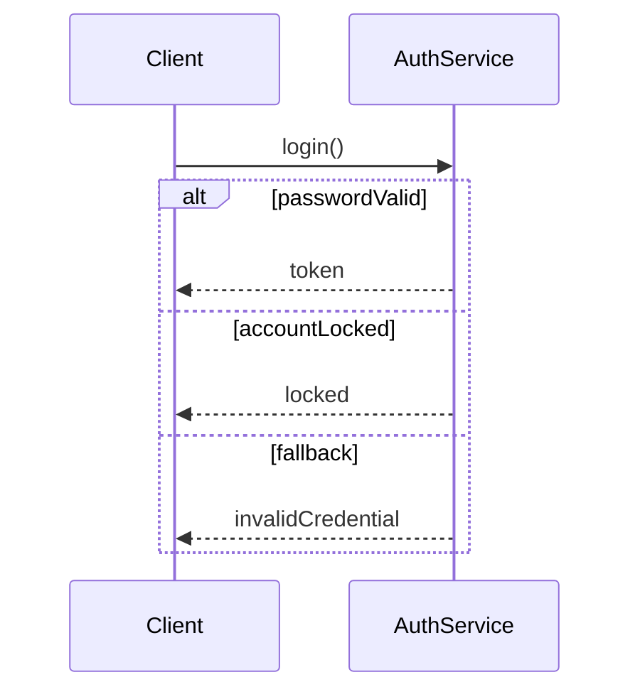
```mermaid
sequenceDiagram
    participant Client
    participant AuthService

    Client->>AuthService: login()
    alt passwordValid
        AuthService-->>Client: token
    else accountLocked
        AuthService-->>Client: locked
    else fallback
        AuthService-->>Client: invalidCredential
    end
```

---

### 2.2 opt — 可选 (Option)

**中文**: 可选

**精确语义**: 要么执行唯一的操作数, 要么什么都不做。语义上等价于只有一个非空操作数和一个空操作数的 alt。

**守卫条件**: 单个操作数, 可选守卫条件

**操作数规则**: 恰好1个操作数

**可视化**:
```
┌──────────────────────────┐
│ opt                      │
│ [condition]              │
│   msg() ──────────>      │
└──────────────────────────┘
```

**代码等价**: `if (condition) { ... }` (无 else 分支)

**Mermaid 示例**:
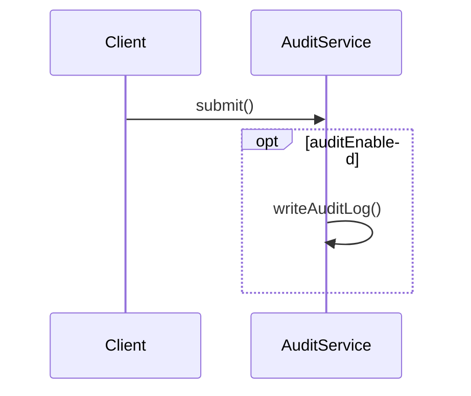
```mermaid
sequenceDiagram
    participant Client
    participant AuditService

    Client->>AuditService: submit()
    opt auditEnabled
        AuditService->>AuditService: writeAuditLog()
    end
```

---

### 2.3 loop — 循环 (Loop / Iteration)

**中文**: 循环/迭代

**精确语义**: 操作数重复执行指定次数。

**迭代边界语法**: `loop(minint [, maxint])`
- `loop` 或 `loop(*)` — 无界循环, 0 到 ∞
- `loop(n)` — 精确 n 次
- `loop(min, max)` — 最少 min 次, 最多 max 次

**守卫条件**: 可选的布尔条件; 每次迭代前评估, 若为 false 则终止循环(即使未达到 minint)

**操作数规则**: 恰好1个操作数

**可视化**:
```
┌──────────────────────────┐
│ loop(1, 10)              │
│ [hasMoreItems]           │
│   process() ──────────>  │
└──────────────────────────┘
```

**代码等价**: 混合 `for` 和 `while` 语义 — 先检查迭代次数界限, 再检查守卫条件

**Mermaid 示例**:
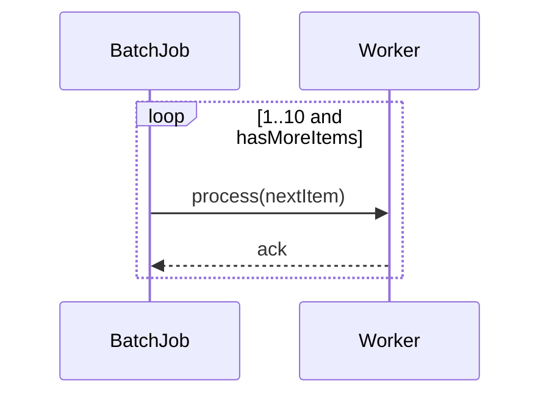
```mermaid
sequenceDiagram
    participant BatchJob
    participant Worker

    loop 1..10 and hasMoreItems
        BatchJob->>Worker: process(nextItem)
        Worker-->>BatchJob: ack
    end
```

**注意**: UML 规范中 loop 的语义同时融合了 for-loop 和 while-loop, 这在实践中可能造成混淆。

---

### 2.4 break — 中断 (Break / Exception)

**中文**: 中断/异常

**精确语义**: 表示异常场景; 若守卫条件为 true, 执行 break 操作数并放弃(abandon)封闭交互片段的剩余部分。

**守卫条件行为**:
- true → 执行 break 操作数, 不再执行封闭片段的后续内容
- false → 忽略 break, 正常继续

**操作数规则**: 恰好1个操作数

**范围限制**: 仅能放弃一层嵌套的封闭片段(不能跨越多层)

**覆盖要求**: 必须覆盖封闭 InteractionFragment 的所有 Lifeline

**警告**: 没有守卫条件的 break 会导致不可预测的行为, 应避免。

**可视化**:
```
┌──────────────────────────┐
│ break                    │
│ [errorOccurred]          │
│   handleError() ───────> │
└──────────────────────────┘
```

**代码等价**: 类似编程语言中的 `break` 或异常处理的提前退出

**Mermaid 示例**:
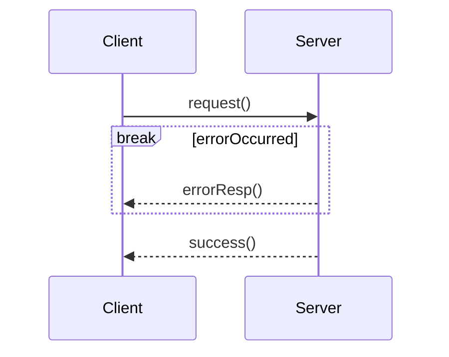
```mermaid
sequenceDiagram
    participant Client
    participant Server

    Client->>Server: request()
    break errorOccurred
        Server-->>Client: errorResp()
    end
    Server-->>Client: success()
```

---

### 2.5 par — 并行 (Parallel)

**中文**: 并行

**精确语义**: 操作数之间可以并行执行, 允许交错(interleaving)。但每个操作数内部的事件顺序保持不变。

**排序规则**:
- 同一操作数内的事件按原始顺序排列
- 不同操作数的事件可以任意交错
- 没有跨操作数的排序约束

**协同区域快捷符号 (Coregion)**: 在单个生命线上, 用水平方括号 `[ ]` 框住的区域表示直接包含的片段被视为 par 的独立操作数。

**可视化**:
```
┌──────────────────────────┐
│ par                      │
│   taskA() ──────────>    │
│ ─ ─ ─ ─ ─ ─ ─ ─ ─ ─ ─  │
│   taskB() ──────────>    │
└──────────────────────────┘
```

**代码等价**: 并发/多线程执行 (`std::thread`, `async/await` 等)

**Mermaid 示例**:
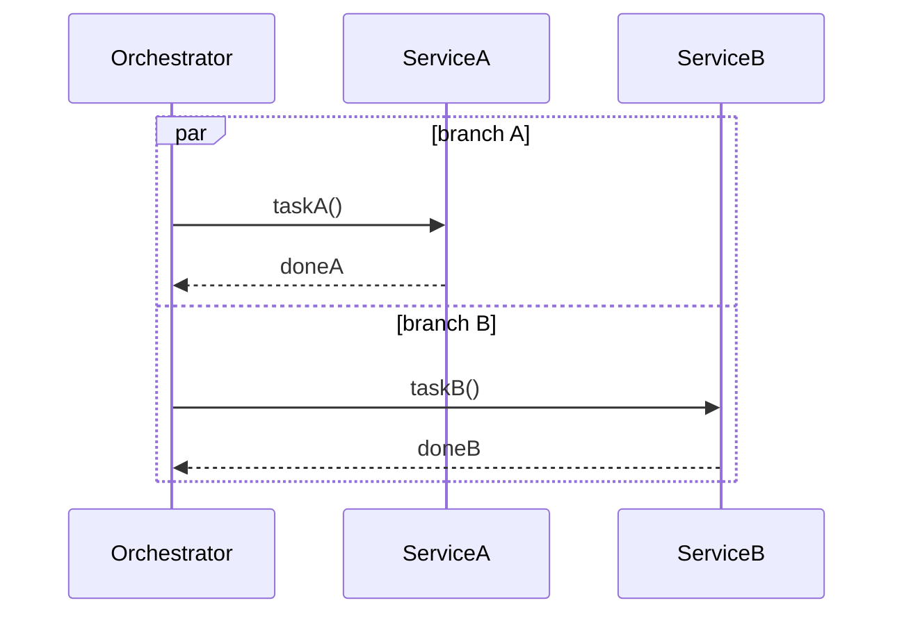
```mermaid
sequenceDiagram
    participant Orchestrator
    participant ServiceA
    participant ServiceB

    par branch A
        Orchestrator->>ServiceA: taskA()
        ServiceA-->>Orchestrator: doneA
    and branch B
        Orchestrator->>ServiceB: taskB()
        ServiceB-->>Orchestrator: doneB
    end
```

---

### 2.6 critical — 临界区 (Critical Region)

**中文**: 临界区

**精确语义**: 定义一个不能被其他 OccurrenceSpecification 交错的原子区域。临界区内的迹(trace)必须原子性地执行。

**隔离性**: 不能被 par 操作符交错

**用途**: 互斥场景, 确保某些操作序列不被打断

**可视化**:
```
┌──────────────────────────┐
│ critical                 │
│   lock() ──────────>     │
│   update() ──────────>   │
│   unlock() ──────────>   │
└──────────────────────────┘
```

**代码等价**: `mutex.lock()` ... `mutex.unlock()` 或 `synchronized` 块

**Mermaid 示例**:
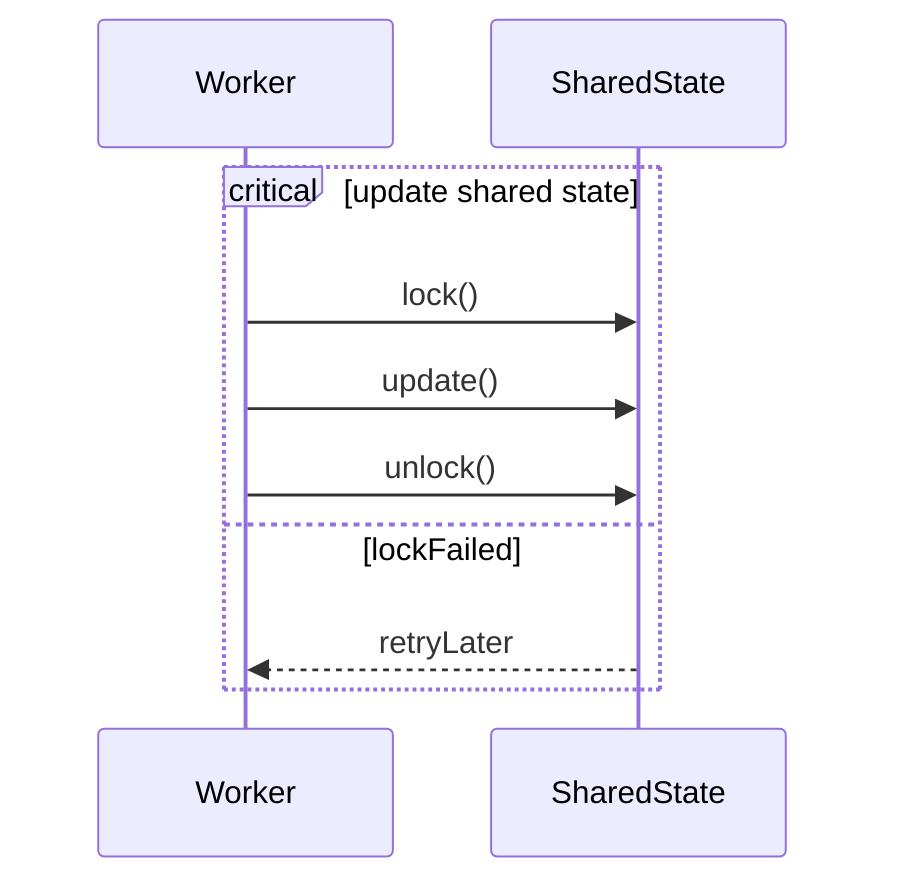
```mermaid
sequenceDiagram
    participant Worker
    participant SharedState

    critical update shared state
        Worker->>SharedState: lock()
        Worker->>SharedState: update()
        Worker->>SharedState: unlock()
    option lockFailed
        SharedState-->>Worker: retryLater
    end
```

---

### 2.7 neg — 否定 (Negative)

**中文**: 否定/无效

**精确语义**: 描述被定义为无效(invalid)的迹组合。否定片段中的迹表示系统失败时会出现的行为。所有非 neg 的交互片段被视为正面的(valid, 应该可能发生)。

**操作数规则**: 恰好1个操作数

**可视化**:
```
┌──────────────────────────┐
│ neg                      │
│   unauthorizedAccess()──>│
└──────────────────────────┘
```

**用途**: 安全性规约——明确指定什么**不应**发生

**Mermaid 示例**:
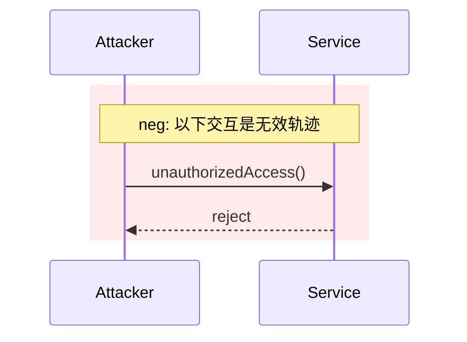
```mermaid
sequenceDiagram
    participant Attacker
    participant Service

    rect rgba(255, 0, 0, 0.08)
        Note over Attacker,Service: neg: 以下交互是无效轨迹
        Attacker->>Service: unauthorizedAccess()
        Service-->>Attacker: reject
    end
```

---

### 2.8 assert — 断言 (Assertion)

**中文**: 断言

**精确语义**: assert 操作数中的序列是唯一有效的延续。所有其他延续都导致无效迹(invalid trace)。正确的系统设计必须满足 assert。

**操作数规则**: 一个或多个操作数

**常见组合**: 通常与 StateInvariant 评估配合使用; 可与 ignore/consider 组合使用, 如 `assert ignore {m, s}`。

**可视化**:
```
┌──────────────────────────┐
│ assert                   │
│   expectedMsg() ───────> │
└──────────────────────────┘
```

**用途**: 指定必须发生的交互序列, 用于正确性验证

**Mermaid 示例**:
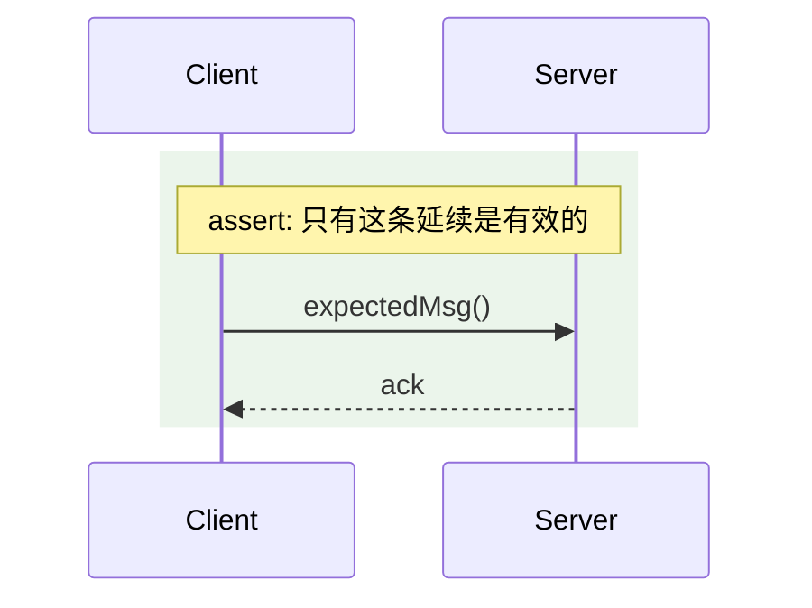
```mermaid
sequenceDiagram
    participant Client
    participant Server

    rect rgba(0, 128, 0, 0.08)
        Note over Client,Server: assert: 只有这条延续是有效的
        Client->>Server: expectedMsg()
        Server-->>Client: ack
    end
```

---

### 2.9 seq — 弱顺序 (Weak Sequencing)

**中文**: 弱顺序

**精确语义**: 操作数之间的弱顺序排列。

**排序规则**:
1. 同一操作数内的排序保持不变
2. 来自不同操作数的、在不同生命线上的 OccurrenceSpecification 可以交错
3. 来自不同操作数的、在同一生命线上的 OccurrenceSpecification 按操作数顺序排列

**退化情况**:
- 当操作数涉及不同的参与者时, seq 退化为 par
- 当操作数涉及相同的参与者时, seq 退化为 strict

**注**: seq 是 interactionOperator 的默认值。

**Mermaid 示例**:
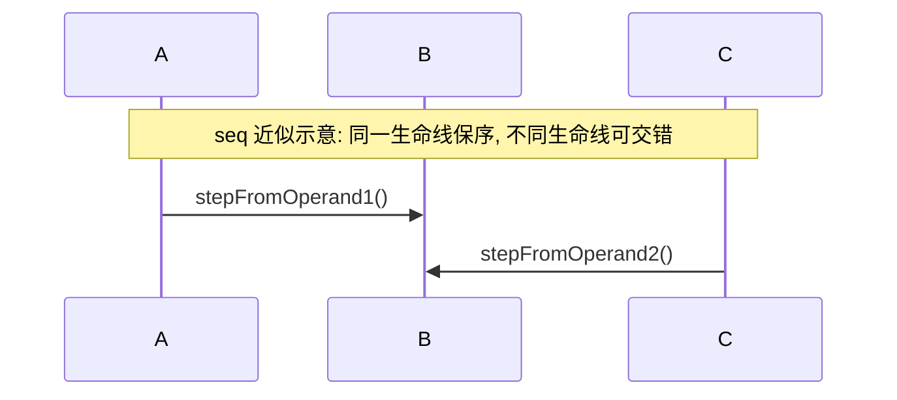
```mermaid
sequenceDiagram
    participant A
    participant B
    participant C

    Note over A,C: seq 近似示意: 同一生命线保序, 不同生命线可交错
    A->>B: stepFromOperand1()
    C->>B: stepFromOperand2()
```

---

### 2.10 strict — 严格顺序 (Strict Sequencing)

**中文**: 严格顺序

**精确语义**: 要求操作数在第一层严格按顺序执行。在 strict 范围内, 垂直坐标在整个范围内都有意义(不仅仅是单个生命线内)。

**与 seq 的区别**: strict 中即使不同生命线上的事件也必须严格按操作数顺序; seq 仅要求同一生命线上的按顺序。

**嵌套规则**: 更低层的操作数不直接与封闭级别的规约比较。

**可视化**:
```
┌──────────────────────────┐
│ strict                   │
│   step1() ──────────>    │
│ ─ ─ ─ ─ ─ ─ ─ ─ ─ ─ ─  │
│   step2() ──────────>    │
└──────────────────────────┘
```

**Mermaid 示例**:
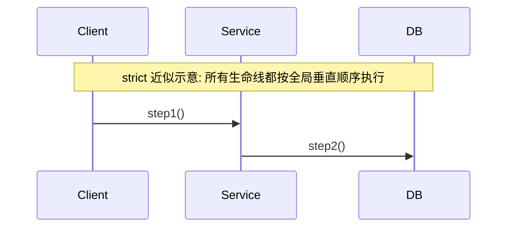
```mermaid
sequenceDiagram
    participant Client
    participant Service
    participant DB

    Note over Client,DB: strict 近似示意: 所有生命线都按全局垂直顺序执行
    Client->>Service: step1()
    Service->>DB: step2()
```

---

### 2.11 ignore — 忽略 (Ignore)

**中文**: 忽略

**精确语义**: 指定某些消息类型在此片段中不重要, 可以隐式忽略。列在花括号中的消息类型被视为无关紧要。

**语法**: `ignore {msg1, msg2, ...}`

**解释**: 被忽略的消息可以在任何地方出现而不影响迹的有效性

**常见组合**: `assert ignore {m, s}` — 断言序列, 同时忽略 m 和 s 类型的消息

---

### 2.12 consider — 考虑 (Consider)

**中文**: 考虑

**精确语义**: ignore 的反面——仅花括号中列出的消息类型是重要的, 其他所有消息类型被忽略。

**语法**: `consider {msg1, msg2, ...}`

**常见组合**: `assert consider {m, s}` — 断言序列, 仅考虑 m 和 s 类型的消息

---

## 第三部分：如何绘制/构建顺序图

---

### 3.1 构建步骤

1. **确定交互范围**: 明确要建模的用例/场景/功能
2. **识别参与者**: 列出所有参与交互的对象/类/组件/actor
3. **排列生命线**: 水平排列所有参与者
4. **绘制消息**: 按时间顺序(自上而下)添加消息箭头
5. **添加控制流**: 使用 CombinedFragment 表示条件/循环/并行
6. **添加约束**: 守卫条件、时间约束、状态不变量
7. **细化**: 添加返回消息、注释、交互引用(ref)

### 3.2 布局规则和约定

**框架 (Frame)**:
- 整个顺序图用矩形框架包围
- 左上角五角形标签: `sd DiagramName`
- 框架是可选的但推荐使用(UML 2.x)

**时间轴**:
- 垂直轴(Y轴)代表时间, 自上而下递增
- 水平轴(X轴)无固有语义, 仅用于排列生命线

**生命线排列**:
- 水平排列在图的顶部
- 通常将"initiator"(发起者)放在最左侧
- Actor 通常放在最左侧或最右侧
- 按消息流的主要方向排列, 减少交叉线
- 系统边界外的参与者放在边缘

**消息排列**:
- 第一条消息通常在图的左上方
- 后续消息依次向下放置
- 同步调用和回复之间的执行规约清楚显示阻塞时间

### 3.3 阅读顺序

1. 识别顶部所有生命线(参与者)
2. 从上到下跟踪消息流
3. 在决策点评估守卫条件
4. 跟踪消息参数和返回值
5. 注意并行执行边界
6. 解析被引用的外部交互(ref)

### 3.4 消息编号方案

UML 标准不强制消息编号, 但常见方案:

1. **简单顺序编号**: 1, 2, 3, 4, ...
2. **嵌套编号(Dewey Decimal)**: 1, 1.1, 1.2, 1.2.1, 2, ...
3. **带前缀编号**: A1, A2, B1, B2 (用于并行片段)

### 3.5 最佳实践

- 每个图聚焦一个用例/场景, 避免过于庞大
- 使用 InteractionUse (ref) 引用子交互来分解复杂图
- 显式标注返回值当它们对理解交互很重要时
- 使用守卫条件澄清条件行为
- 用 break 片段处理异常场景而不是用 alt 的额外分支
- 保持一致的命名规范: 实例名下划线, 角色名不下划线
- 避免过多的嵌套(超过3层 CombinedFragment 嵌套时考虑拆分)

---

## 第四部分：XMI/XML 表示

---

### 4.1 XMI 概述

XMI (XML Metadata Interchange) 是 OMG 维护的基于 XML 的标准, 用于序列化 MOF 兼容的元数据。XMI 定义三个核心机制:
1. 将对象表示为 XML 元素和属性
2. 在文件内或跨文件链接对象
3. 使用 XML Schema 验证 XMI 文档

当前标准: XMI 2.5.1, 与 UML 2.5.1 对齐。

### 4.2 命名空间约定

```xml
<?xml version="1.0" encoding="UTF-8"?>
<xmi:XMI xmi:version="2.5.1"
  xmlns:xmi="http://www.omg.org/spec/XMI/20131001"
  xmlns:uml="http://www.omg.org/spec/UML/20131001">
```

**常见命名空间**:
| 前缀 | URI | 说明 |
|------|-----|------|
| xmi | http://www.omg.org/spec/XMI/20131001 | XMI 基础 |
| uml | http://www.omg.org/spec/UML/20131001 | UML 元模型 |
| sysml | http://www.omg.org/spec/SysML/20150709 | SysML Profile |

**注**: 不同工具版本使用不同的命名空间 URI:
- Enterprise Architect: `http://schema.omg.org/spec/UML/2.1`
- Papyrus: `http://www.eclipse.org/uml2/5.0.0/UML`
- MagicDraw: `http://www.omg.org/spec/UML/20131001`

### 4.3 完整 XMI 顺序图结构

以下是一个包含多种元素的完整 XMI 示例:

```xml
<?xml version="1.0" encoding="UTF-8"?>
<xmi:XMI xmi:version="2.1"
  xmlns:uml="http://schema.omg.org/spec/UML/2.1"
  xmlns:xmi="http://schema.omg.org/spec/XMI/2.1">

  <uml:Model xmi:id="MODEL_001" name="SequenceDiagramModel">
    <packagedElement xmi:type="uml:Package" xmi:id="PKG_001" name="SequenceDiagrams">

      <!-- 参与交互的类定义 (通常在另一个包中) -->
      <packagedElement xmi:type="uml:Class" xmi:id="CLS_Client" name="Client"/>
      <packagedElement xmi:type="uml:Class" xmi:id="CLS_Server" name="Server"/>
      <packagedElement xmi:type="uml:Class" xmi:id="CLS_DB" name="Database"/>

      <!-- Collaboration 包含 Interaction -->
      <packagedElement xmi:type="uml:Collaboration" xmi:id="COL_001" name="LoginCollab">
        <ownedAttribute xmi:type="uml:Property" xmi:id="PROP_client"
                        name="client" type="CLS_Client"/>
        <ownedAttribute xmi:type="uml:Property" xmi:id="PROP_server"
                        name="server" type="CLS_Server"/>
        <ownedAttribute xmi:type="uml:Property" xmi:id="PROP_db"
                        name="db" type="CLS_DB"/>

        <ownedBehavior xmi:type="uml:Interaction" xmi:id="INT_001" name="LoginSequence">

          <!-- ===== Lifelines ===== -->
          <lifeline xmi:type="uml:Lifeline" xmi:id="LL_001"
                    name="client" represents="PROP_client"/>
          <lifeline xmi:type="uml:Lifeline" xmi:id="LL_002"
                    name="server" represents="PROP_server"/>
          <lifeline xmi:type="uml:Lifeline" xmi:id="LL_003"
                    name="db" represents="PROP_db"/>

          <!-- ===== Fragments (按时间顺序) ===== -->

          <!-- 消息1的发送和接收出现 -->
          <fragment xmi:type="uml:MessageOccurrenceSpecification"
                    xmi:id="MOS_001_send" name="login_send" covered="LL_001"/>
          <fragment xmi:type="uml:MessageOccurrenceSpecification"
                    xmi:id="MOS_001_recv" name="login_recv" covered="LL_002"/>

          <!-- 执行规约 (server 处理 login) -->
          <fragment xmi:type="uml:BehaviorExecutionSpecification"
                    xmi:id="BES_001" name="BES_login" covered="LL_002"
                    start="MOS_001_recv" finish="MOS_002_send"/>

          <!-- CombinedFragment: alt -->
          <fragment xmi:type="uml:CombinedFragment" xmi:id="CF_001"
                    name="authCheck" interactionOperator="alt">
            <covered xmi:idref="LL_002"/>
            <covered xmi:idref="LL_003"/>

            <!-- 第一个操作数: 认证成功 -->
            <operand xmi:type="uml:InteractionOperand" xmi:id="IO_001">
              <guard xmi:type="uml:InteractionConstraint" xmi:id="IC_001">
                <specification xmi:type="uml:LiteralString"
                               xmi:id="LS_001" value="credentials valid"/>
              </guard>
              <!-- 操作数内的消息出现 -->
              <fragment xmi:type="uml:MessageOccurrenceSpecification"
                        xmi:id="MOS_003_send" name="query_send" covered="LL_002"/>
              <fragment xmi:type="uml:MessageOccurrenceSpecification"
                        xmi:id="MOS_003_recv" name="query_recv" covered="LL_003"/>
            </operand>

            <!-- 第二个操作数: 认证失败 -->
            <operand xmi:type="uml:InteractionOperand" xmi:id="IO_002">
              <guard xmi:type="uml:InteractionConstraint" xmi:id="IC_002">
                <specification xmi:type="uml:LiteralString"
                               xmi:id="LS_002" value="else"/>
              </guard>
              <fragment xmi:type="uml:MessageOccurrenceSpecification"
                        xmi:id="MOS_004_send" name="error_send" covered="LL_002"/>
              <fragment xmi:type="uml:MessageOccurrenceSpecification"
                        xmi:id="MOS_004_recv" name="error_recv" covered="LL_001"/>
            </operand>
          </fragment>

          <!-- 回复消息的出现 -->
          <fragment xmi:type="uml:MessageOccurrenceSpecification"
                    xmi:id="MOS_002_send" name="result_send" covered="LL_002"/>
          <fragment xmi:type="uml:MessageOccurrenceSpecification"
                    xmi:id="MOS_002_recv" name="result_recv" covered="LL_001"/>

          <!-- ===== Messages ===== -->
          <message xmi:type="uml:Message" xmi:id="MSG_001" name="login"
                   messageSort="synchCall"
                   sendEvent="MOS_001_send" receiveEvent="MOS_001_recv"/>
          <message xmi:type="uml:Message" xmi:id="MSG_002" name="result"
                   messageSort="reply"
                   sendEvent="MOS_002_send" receiveEvent="MOS_002_recv"/>
          <message xmi:type="uml:Message" xmi:id="MSG_003" name="queryUser"
                   messageSort="synchCall"
                   sendEvent="MOS_003_send" receiveEvent="MOS_003_recv"/>
          <message xmi:type="uml:Message" xmi:id="MSG_004" name="authError"
                   messageSort="synchCall"
                   sendEvent="MOS_004_send" receiveEvent="MOS_004_recv"/>

        </ownedBehavior>
      </packagedElement>
    </packagedElement>
  </uml:Model>
</xmi:XMI>
```

### 4.4 Loop CombinedFragment XMI 示例

```xml
<fragment xmi:type="uml:CombinedFragment" xmi:id="CF_LOOP_001"
          name="retryLoop" interactionOperator="loop">
  <operand xmi:type="uml:InteractionOperand" xmi:id="IO_LOOP_001">
    <guard xmi:type="uml:InteractionConstraint" xmi:id="IC_LOOP_001">
      <specification xmi:type="uml:LiteralString" value="retryCount &lt; 3"/>
      <minint xmi:type="uml:LiteralInteger" value="0"/>
      <maxint xmi:type="uml:LiteralInteger" value="3"/>
    </guard>
    <!-- loop body fragments here -->
  </operand>
</fragment>
```

### 4.5 InteractionUse (ref) XMI 示例

```xml
<fragment xmi:type="uml:InteractionUse" xmi:id="IU_001"
          name="Authenticate" refersTo="INT_AUTH_001">
  <covered xmi:idref="LL_001"/>
  <covered xmi:idref="LL_002"/>
  <argument xmi:type="uml:LiteralString" value="tokenXYZ"/>
</fragment>
```

### 4.6 工具特定差异

#### Enterprise Architect (Sparx Systems)
- 使用 XMI 2.1 命名空间: `http://schema.omg.org/spec/UML/2.1`
- 在 `<xmi:Extension>` 中包含大量工具特定的渲染信息
- 包括: 泳道配置、样式属性、几何定位坐标
- Collaboration 作为 Interaction 的容器
- 使用 `extender="Enterprise Architect"` 标记扩展

#### Papyrus (Eclipse)
- 生成3个文件: `model.di`, `model.notation`, `model.uml`
- `.uml` 文件是标准 XMI
- 使用命名空间: `http://www.eclipse.org/uml2/5.0.0/UML`
- Interaction 可直接作为 packagedElement
- 不变量信息和图形布局在 `.notation` 文件中

#### MagicDraw / Cameo (Dassault Systemes)
- 使用标准 OMG 命名空间
- 支持 SysML profile 扩展
- XMI 导出包含完整的 stereotype 应用
- 支持自定义 tagged values

### 4.7 关键 XMI 元素映射表

| UML 元素 | xmi:type 值 | 容器元素 |
|----------|-------------|----------|
| Interaction | uml:Interaction | packagedElement 或 ownedBehavior |
| Lifeline | uml:Lifeline | lifeline (under Interaction) |
| Message | uml:Message | message (under Interaction) |
| MessageOccurrenceSpecification | uml:MessageOccurrenceSpecification | fragment (under Interaction/Operand) |
| BehaviorExecutionSpecification | uml:BehaviorExecutionSpecification | fragment |
| ActionExecutionSpecification | uml:ActionExecutionSpecification | fragment |
| ExecutionOccurrenceSpecification | uml:ExecutionOccurrenceSpecification | fragment |
| DestructionOccurrenceSpecification | uml:DestructionOccurrenceSpecification | fragment |
| CombinedFragment | uml:CombinedFragment | fragment |
| InteractionOperand | uml:InteractionOperand | operand (under CombinedFragment) |
| InteractionConstraint | uml:InteractionConstraint | guard (under InteractionOperand) |
| InteractionUse | uml:InteractionUse | fragment |
| StateInvariant | uml:StateInvariant | fragment |
| Gate | uml:Gate | formalGate / actualGate / cfragmentGate |
| Comment | uml:Comment | ownedComment |
| GeneralOrdering | uml:GeneralOrdering | generalOrdering |
| Continuation | uml:Continuation | fragment |

---

## 第五部分：高级主题

---

### 5.1 交互片段排序 (Interaction Fragment Ordering)

在 Interaction 中, fragment 是一个有序集合(`{ordered}`)。fragment 的顺序决定了顺序图中事件的时间排列:
- 顶层 fragment 按它们在集合中的位置排序
- CombinedFragment 内的 operand 按顺序排列
- 每个 operand 内的 fragment 也按顺序排列

排序的关键规则:
- 同一生命线上的 OccurrenceSpecification 严格按序排列
- 不同生命线上的 OccurrenceSpecification 之间的排序取决于 CombinedFragment 操作符(seq, strict, par 等)

### 5.2 迹语义 (Trace Semantics)

UML 顺序图的形式语义基于**迹(trace)**的概念:

**定义**: 一个迹是一系列事件出现(event occurrences)的序列, 每个事件由一个 OccurrenceSpecification 描述。

**交互义务 (Interaction Obligation)**: 语义表示为一个交互义务对 `(p, n)`, 其中:
- `p` = 正面迹集合(positive/valid traces) — 期望的、可接受的行为
- `n` = 负面迹集合(negative/invalid traces) — 不期望的、不可接受的行为
- 不在 p 或 n 中的迹 = 未被该交互描述的(既不可知是有效还是无效)

**各操作符对迹的影响**:

| 操作符 | 迹语义 |
|--------|--------|
| alt | p = 所有操作数的 p 集合的并集; n = 类似并集 |
| opt | p = 操作数的 p 与空迹的并集 |
| loop | p = 操作数 p 的指定次数序列组合 |
| break | p = 封闭片段前缀 + break 操作数的 p |
| par | p = 操作数迹的所有合法交错 |
| seq | p = 弱顺序组合 |
| strict | p = 严格顺序连接 |
| neg | 操作数的迹被归入 n 集合(无效迹) |
| assert | 仅操作数的迹有效, 所有其他延续归入 n |
| critical | 迹必须原子执行, 不允许交错 |
| ignore | 被忽略的消息可以在迹中任意插入 |
| consider | 仅考虑列出的消息, 其他可任意插入 |

**组合性问题**: UML 规范中迹语义的组合性存在公认的问题:
- 事件排序和有效/无效迹分类的组合语义不完全一致
- 从片段含义和语法组合操作符推导完整图的含义有困难

### 5.3 协同区域 (Coregion)

**定义**: 协同区域是并行组合片段的一种简写符号。

**表示**: 在单个生命线上, 用水平方括号 `[ ]` 框住一段区域。

**语义**: 该区域内直接包含的所有片段被视为独立的 par 操作数——即它们之间没有顺序约束。

**用途**: 当只需要在一个生命线上表示事件顺序无关时, 无需使用完整的 par CombinedFragment。

### 5.4 时间约束和持续时间约束

**时间模型**:
- 时间从上到下流动
- TimeObservation 记录事件的绝对时间点 (如 `t`)
- DurationObservation 记录两个事件之间的持续时间 (如 `d`)
- TimeConstraint 约束事件时间点在某个区间内 (如 `{t..t+3}`)
- DurationConstraint 约束持续时间在某个区间内 (如 `{d..3*d}`)

**实际应用**: 建模实时系统时特别有用, 例如:
- `{0..13}` — CardOut 操作被约束持续0到13个时间单位
- `{t..t+3}` — 接收事件必须在 t 到 t+3 之间发生
- `{> 3s & < 5min}` — 持续时间大于3秒小于5分钟

### 5.5 交互概览图关系 (Interaction Overview Diagram)

交互概览图是活动图的一种变体, 其中节点是交互或交互使用(InteractionUse), 而不是普通活动节点。它提供了交互之间控制流的高层视图。

**与顺序图的关系**:
- 交互概览图中的每个节点可以是一个内联的顺序图(Interaction)或对另一个顺序图的引用(InteractionUse/ref)
- 使用活动图的决策节点、合并节点、分叉/汇合节点来编排多个顺序图
- 注: SysML 排除了交互概览图(认为功能与顺序图重叠)

### 5.6 SysML 特定扩展

SysML 的顺序图与 UML 的顺序图基本相同, 差异很小:

**相同之处**:
- 核心元素完全相同: Lifeline, Message, CombinedFragment 等
- 所有 CombinedFragment 操作符都适用
- 消息类型和箭头符号相同

**主要差异**:
1. **上下文**: SysML 中 Lifeline 代表 Block 的 Part(而不仅仅是类的对象)
2. **用途**: SysML 应用于系统工程(硬件+软件+人), 而不仅仅是软件
3. **排除**: SysML 排除了交互概览图和通信图
4. **Stereotype 扩展**: SysML 可能使用 Block stereotype 来标识生命线类型
5. **端口**: SysML 中 Lifeline 可以通过 FlowPort/ProxyPort 通信

---

## 第六部分：顺序图中的常见设计模式

---

### 6.1 请求-响应模式 (Request-Response)

**描述**: 最基础的顺序图模式, 一个对象向另一个发送同步请求, 等待响应。

**结构**:
```
Client          Server
  |                |
  |-- request() ->|
  |                |--- (processing)
  |<-- response --|
  |                |
```

**消息类型**: synchCall + reply
**典型用途**: HTTP 请求、RPC 调用、方法调用

**Mermaid 示例**:
```mermaid
sequenceDiagram
    participant Client
    participant Server

    Client->>Server: request()
    activate Server
    Server-->>Client: response
    deactivate Server
```

**伪代码**:
```cpp
// Client 端
void Client::doWork() {
    Response res = server.request(params);  // synchCall: 同步阻塞等待
    processResponse(res);
}

// Server 端
Response Server::request(Params params) {
    Result result = process(params);
    return Response(result);  // reply: 返回响应
}
```

### 6.2 观察者/回调模式 (Observer/Callback)

**描述**: Subject 维护 Observer 列表, 状态变化时通知所有 Observer。

**结构**:
```
Observer      Subject      Observer2
  |              |              |
  |-- attach()->|              |
  |              |<- attach() -|
  |              |              |
  |              |-- setState() (self)
  |              |-- notify() (self)
  |<- update() -|              |
  |-- getState()->|            |
  |<- state ---  |             |
  |              |-- update()->|
  |              |   getState()->|
  |              |<- state ----  |
```

**特点**:
- 使用自身消息(self-message)表示内部处理
- 使用 loop CombinedFragment 表示对所有 Observer 的通知
- 回调导致嵌套的执行规约

**Mermaid 示例**:
```mermaid
sequenceDiagram
    participant Observer1
    participant Subject
    participant Observer2

    Observer1->>Subject: attach()
    Observer2->>Subject: attach()
    Subject->>Subject: setState()
    Subject->>Subject: notify()
    loop for each observer
        Subject->>Observer1: update()
        Observer1->>Subject: getState()
        Subject-->>Observer1: state
        Subject->>Observer2: update()
        Observer2->>Subject: getState()
        Subject-->>Observer2: state
    end
```

**伪代码**:
```cpp
class Subject {
    vector<Observer*> observers;
    State state;

    void attach(Observer* obs) {
        observers.push_back(obs);
    }

    void setState(State newState) {
        state = newState;
        notify();  // self-message
    }

    void notify() {
        for (auto* obs : observers) {          // loop [for each observer]
            obs->update(this);                 // asynch/synchCall
        }
    }

    State getState() { return state; }
};

class Observer {
    void update(Subject* subject) {
        State s = subject->getState();         // synchCall + reply
        react(s);
    }
};
```

### 6.3 工厂/创建模式 (Factory/Creation)

**描述**: 工厂对象创建新的对象实例。

**结构**:
```
Client        Factory       :Product
  |              |
  |-- create()->|
  |              |-- <<create>> ──> :Product
  |              |              |
  |              |<-- init() --|
  |<-- product -|              |
```

**消息类型**: createMessage (虚线+开放箭头, 指向新生命线头部)
**特点**: 被创建的 Lifeline 在创建消息到达的位置开始(头部位置低于其他 Lifeline)

**Mermaid 示例**:
```mermaid
sequenceDiagram
    participant Client
    participant Factory
    create participant Product

    Client->>Factory: create()
    Factory->>Product: <<create>>
    Product-->>Factory: initDone
    Factory-->>Client: product
```

**伪代码**:
```cpp
class Factory {
    Product* create(string type) {
        Product* product = new Product(type);  // createMessage: <<create>>
        product->init();                       // synchCall: 初始化
        return product;                        // reply: 返回产品实例
    }
};

// Client 端
void Client::run() {
    Product* p = factory.create("TypeA");      // synchCall
    p->use();
}
```

### 6.4 责任链模式 (Chain of Responsibility)

**描述**: 请求沿着处理者链传递, 直到某个处理者处理它。

**结构**:
```
Client      Handler1     Handler2     Handler3
  |            |            |            |
  |-- handle()->|           |            |
  |            |-- handle()->|           |
  |            |            |-- handle()->|
  |            |            |<-- result --|
  |            |<-- result --|            |
  |<-- result --|            |            |
```

**特点**:
- 可用 alt CombinedFragment 在每个 Handler 处添加"能处理"的判断
- 使用 break 片段表示某个 Handler 成功处理后中断链

**Mermaid 示例**:
```mermaid
sequenceDiagram
    participant Client
    participant Handler1
    participant Handler2
    participant Handler3

    Client->>Handler1: handle(req)
    alt Handler1 cannot handle
        Handler1->>Handler2: handle(req)
        alt Handler2 cannot handle
            Handler2->>Handler3: handle(req)
            Handler3-->>Handler2: result
        else Handler2 handles
            Handler2-->>Handler1: result
        end
        Handler1-->>Client: result
    else Handler1 handles
        Handler1-->>Client: result
    end
```

**伪代码**:
```cpp
class Handler {
    Handler* successor;

    Result handle(Request req) {
        if (canHandle(req)) {                  // alt [canHandle]
            return doHandle(req);              // 本节点处理并返回
        } else if (successor != nullptr) {     // alt [cannot handle]
            return successor->handle(req);     // synchCall: 传递给下一个
        }
        return Result::unhandled();
    }
};

// Client 端
void Client::run() {
    Result res = handler1.handle(request);     // synchCall: 进入责任链
}
```

### 6.5 错误处理模式 (Error Handling)

**描述**: 使用 break CombinedFragment 表示异常流。

**结构**:
```
┌─────────────────────────────────────┐
│ sd NormalFlow                       │
│                                     │
│   Client         Server             │
│     |               |               │
│     |-- request()->|               │
│     |               |               │
│   ┌─────────────────────────┐      │
│   │ break                   │      │
│   │ [error occurred]        │      │
│   │   |<-- errorResp() --|  │      │
│   └─────────────────────────┘      │
│     |               |               │
│     |<-- success() --|              │
└─────────────────────────────────────┘
```

**特点**:
- break 片段在守卫条件满足时执行, 跳过后续正常流程
- 也可用 alt + neg 组合: alt 的一个操作数包含 neg 片段
- opt 片段可用于可选的错误日志记录

**Mermaid 示例**:
```mermaid
sequenceDiagram
    participant Client
    participant Server

    Client->>Server: request()
    break errorOccurred
        Server-->>Client: errorResp()
    end
    Server-->>Client: success()
```

**伪代码**:
```cpp
Response Server::request(Params params) {
    if (errorOccurred(params)) {               // break [error occurred]
        return Response::error("failed");      // 提前终止, 跳过后续正常流程
    }
    // --- 正常流程(break 未触发时执行) ---
    Result result = process(params);
    return Response::success(result);
}
```

### 6.6 异步消息模式 (Async Messaging)

**描述**: 使用异步消息实现非阻塞通信。

**模式变体**:

#### Fire-and-Forget (发射即忘)
```
Sender          Receiver
  |                |
  |== signal() ==>|  (open arrowhead)
  |                |
  | (continues)    |--- (processing)
```

**Mermaid 示例**:
```mermaid
sequenceDiagram
    participant Sender
    participant Receiver

    Sender-)Receiver: signal()
    Note right of Sender: continues immediately
    Receiver->>Receiver: processing
```

#### Async with Callback (异步+回调)
```
Client        Service       Client
  |              |              |
  |== request ==>|             |
  | (continues)  |             |
  |              |-- process() |
  |<== callback ==|            |
```

**Mermaid 示例**:
```mermaid
sequenceDiagram
    participant Client
    participant Service

    Client-)Service: request()
    Note right of Client: continues
    Service->>Service: process()
    Service-)Client: callback(result)
```

#### Publish-Subscribe (发布-订阅)
```
Publisher      Broker       Sub1        Sub2
  |              |            |           |
  |== publish ==>|           |           |
  |              |== notify ==>|         |
  |              |== notify ============>|
```

**Mermaid 示例**:
```mermaid
sequenceDiagram
    participant Publisher
    participant Broker
    participant Sub1
    participant Sub2

    Publisher-)Broker: publish(event)
    par notify subscribers
        Broker-)Sub1: notify(event)
    and notify subscribers
        Broker-)Sub2: notify(event)
    end
```

**消息类型**: asynchCall 或 asynchSignal (实线+开放箭头)

**伪代码**:
```cpp
// Fire-and-Forget
void Sender::run() {
    receiver.signal(data);                     // asynchSignal: 发送后立即返回
    doOtherWork();                             // 不等待 receiver 处理完成
}

// Async with Callback
void Client::run() {
    service.request(data, [this](Result r) {   // asynchCall + 注册回调
        this->onCallback(r);
    });
    doOtherWork();                             // 立即继续
}

void Service::request(Data data, Callback cb) {
    async_execute([=]() {
        Result r = process(data);              // self-message: 内部处理
        cb(r);                                 // asynchSignal: 回调通知
    });
}

// Publish-Subscribe
void Publisher::publish(Event event) {
    broker.publish(event);                     // asynchSignal
}

void Broker::publish(Event event) {
    for (auto* sub : subscribers) {            // par: 并行通知
        async_send(sub, event);                // asynchSignal: notify
    }
}
```

### 6.7 中介者/控制器模式 (Mediator / Controller)

**描述**: 一个中央控制器生命线协调多个子系统之间的交互, 其他生命线不直接通信。序列图呈现"星型"拓扑。

**结构**:
```
SubA        Controller      SubB        SubC
  |              |            |           |
  |              |-- cmdA() ->|           |
  |              |<-- ack ----|           |
  |              |-- cmdB() ------------>|
  |              |<-- ack --------------|
  |<-- notify --|             |           |
```

**特点**:
- 所有消息都经过中央控制器, 子系统之间无直接通信
- 降低子系统间耦合, 便于独立替换子系统
- 控制器生命线上的执行规约较长, 体现协调职责

**Mermaid 示例**:
```mermaid
sequenceDiagram
    participant SubA
    participant Controller
    participant SubB
    participant SubC

    Controller->>SubB: cmdA()
    activate SubB
    SubB-->>Controller: ack
    deactivate SubB
    Controller->>SubC: cmdB()
    activate SubC
    SubC-->>Controller: ack
    deactivate SubC
    Controller->>SubA: notify(result)
```

**伪代码**:
```cpp
class Controller {
    SubA* subA;
    SubB* subB;
    SubC* subC;

    void orchestrate() {
        auto ack1 = subB->cmdA(params);        // synchCall: 协调子系统B
        auto ack2 = subC->cmdB(params);        // synchCall: 协调子系统C
        subA->notify(aggregate(ack1, ack2));   // synchCall: 通知子系统A
    }
};

// 子系统之间不直接通信, 所有交互通过 Controller 中转
```

### 6.8 并发/分叉-汇合模式 (Fork-Join / Parallel)

**描述**: 使用 `par` 片段, 一个控制器同时向多个子系统发出并行请求, 然后等待所有响应汇聚后继续。

**结构**:
```
Controller      SubA         SubB         SubC
  |              |            |            |
  |┌─par────────────────────────────────┐ |
  |│ |-- reqA() ->|           |         │ |
  |│ |<-- resA ---|           |         │ |
  |├─and────────────────────────────────┤ |
  |│ |-- reqB() ------------>|          │ |
  |│ |<-- resB --------------|          │ |
  |├─and────────────────────────────────┤ |
  |│ |-- reqC() ---------------------->│ |
  |│ |<-- resC -----------------------|│ |
  |└────────────────────────────────────┘ |
  |              |            |            |
  |-- aggregate() (self)                   |
```

**特点**:
- `par` 片段内的各操作数并行执行
- 所有并行分支完成后, 控制流汇合到 `par` 片段之后继续
- 适用于并行数据采集、多服务聚合等场景

**Mermaid 示例**:
```mermaid
sequenceDiagram
    participant Controller
    participant SubA
    participant SubB
    participant SubC

    par request A
        Controller->>SubA: reqA()
        SubA-->>Controller: resA
    and request B
        Controller->>SubB: reqB()
        SubB-->>Controller: resB
    and request C
        Controller->>SubC: reqC()
        SubC-->>Controller: resC
    end
    Controller->>Controller: aggregate()
```

**伪代码**:
```cpp
void Controller::fetchAll() {
    // par: 并行发起请求
    future<ResA> fA = async([&]() {
        return subA->reqA();                   // par operand 1
    });
    future<ResB> fB = async([&]() {
        return subB->reqB();                   // par operand 2
    });
    future<ResC> fC = async([&]() {
        return subC->reqC();                   // par operand 3
    });

    // 汇合: 等待所有并行分支完成
    ResA a = fA.get();
    ResB b = fB.get();
    ResC c = fC.get();

    aggregate(a, b, c);                        // self-message: 聚合结果
}
```

### 6.9 分层引用模式 (Hierarchical Decomposition)

**描述**: 使用 `ref` 片段将复杂交互拆分为多个子序列图。主图只展示高层流程, 细节封装在被引用的交互中。这是管理复杂度的核心手段。

**结构**:
```
Client        Server        Database
  |              |              |
  |-- login() ->|              |
  |              |              |
  |┌─ref─────────────────────┐ |
  |│ AuthenticateUser        │ |
  |└─────────────────────────┘ |
  |              |              |
  |┌─ref─────────────────────┐ |
  |│ LoadUserProfile         │ |
  |└─────────────────────────┘ |
  |              |              |
  |<-- session -|              |
```

**特点**:
- 每个 `ref` 片段引用另一个完整的 Interaction(子序列图)
- 支持逐步精化(stepwise refinement): 顶层展示概要流程, 各 ref 展开后呈现详细步骤
- 通过 Gate 进行实际参数与形式参数的绑定
- 提高可维护性, 避免单张序列图过于庞大

**Mermaid 示例**:
```mermaid
sequenceDiagram
    participant Client
    participant Server
    participant Database

    Client->>Server: login(user, pass)
    rect rgb(200, 220, 240)
        Note over Server, Database: ref AuthenticateUser
        Server->>Database: query(user, pass)
        Database-->>Server: authResult
    end
    rect rgb(200, 220, 240)
        Note over Server, Database: ref LoadUserProfile
        Server->>Database: getProfile(userId)
        Database-->>Server: profile
    end
    Server-->>Client: session
```

**伪代码**:
```cpp
// 主流程: 对应顶层序列图
Session Server::login(string user, string pass) {
    AuthResult auth = authenticateUser(user, pass);  // ref AuthenticateUser
    Profile profile = loadUserProfile(auth.userId);  // ref LoadUserProfile
    return Session(auth, profile);
}

// 子序列图 ref AuthenticateUser: 展开细节
AuthResult Server::authenticateUser(string user, string pass) {
    auto row = database.query(user, pass);           // synchCall
    return AuthResult(row);
}

// 子序列图 ref LoadUserProfile: 展开细节
Profile Server::loadUserProfile(int userId) {
    auto data = database.getProfile(userId);         // synchCall
    return Profile(data);
}
```

### 6.10 状态驱动交互模式 (State-Driven Interaction)

**描述**: 结合状态不变量(StateInvariant), 消息的发送或接收以参与者当前状态为前提条件, 将序列图与状态机图关联起来。

**结构**:
```
Client          Device
  |                |
  |        {Idle}  |   ← 状态不变量
  |-- start() --->|
  |       {Running}|
  |-- getData() ->|
  |<-- data ------|
  |-- stop() ---->|
  |         {Idle} |
```

**特点**:
- StateInvariant 标注在生命线上, 约束某一时刻参与者必须处于的状态
- 消息的守卫条件(guard)可以引用生命线的当前状态
- 建立序列图与状态机图之间的一致性约束
- 适用于嵌入式系统、协议建模等状态敏感的场景

**Mermaid 示例**:
```mermaid
sequenceDiagram
    participant Client
    participant Device

    Note right of Device: {Idle}
    Client->>Device: start()
    Note right of Device: {Running}
    Client->>Device: getData()
    Device-->>Client: data
    Client->>Device: stop()
    Note right of Device: {Idle}
```

**伪代码**:
```cpp
enum class DeviceState { Idle, Running };

class Device {
    DeviceState state = DeviceState::Idle;

    void start() {
        assert(state == DeviceState::Idle);    // StateInvariant: {Idle}
        state = DeviceState::Running;          // 状态迁移
    }

    Data getData() {
        assert(state == DeviceState::Running); // StateInvariant: {Running}
        return acquireData();
    }

    void stop() {
        assert(state == DeviceState::Running); // StateInvariant: {Running}
        state = DeviceState::Idle;             // 状态迁移回 Idle
    }
};

// Client 端
void Client::run() {
    // Device 此时必须处于 {Idle} 状态
    device.start();
    // Device 现在处于 {Running} 状态
    Data d = device.getData();
    device.stop();
    // Device 回到 {Idle} 状态
}
```

---

## 第七部分：设计范式 (Design Paradigms)

从更高的方法论层面, 序列图的使用遵循以下范式:

---

### 7.1 场景驱动建模 (Scenario-Based Modeling)

每个序列图对应系统的一个具体使用场景或用例实现。这是最主流的范式——先定义用例, 再用序列图逐一细化每个场景的交互过程。

**核心思路**:
- 一个用例(Use Case)对应一个或多个序列图
- 主成功场景(Main Success Scenario)用一张序列图表示
- 替代流和异常流用 `alt`/`break` 片段表示, 或拆分为独立序列图

**适用阶段**: 需求分析、功能验证

### 7.2 黑盒 vs 白盒建模 (Black-box vs White-box)

**黑盒序列图**: 系统作为一个整体生命线, 与外部 Actor 交互, 用于需求层面。
**白盒序列图**: 打开系统内部, 展示内部 Block/Part 之间的协作, 用于设计层面。

这对应 SysML 的多层次建模理念:
- 黑盒图关注"系统做什么"(What)
- 白盒图关注"系统怎么做"(How)
- 两者通过相同的外部消息接口保持一致性

### 7.3 契约式设计 (Design by Contract)

通过前置/后置状态不变量(StateInvariant)和消息的前置条件(guard), 将序列图当作交互契约来约束参与者的行为。

**要素**:
- **前置条件**: 消息发送前, 接收方必须处于特定状态(StateInvariant)
- **后置条件**: 消息处理后, 参与者状态发生预期变化
- **守卫条件**: CombinedFragment 的 guard 表达式约束执行路径

### 7.4 逐步精化 (Stepwise Refinement)

从抽象的高层交互逐步细化到具体实现:
- 第一层可能只有两三条消息, 展示系统级交互概要
- 通过 `ref` 引用逐层展开, 每层增加更多细节
- 每次精化保持与上层的语义一致性(相同的外部可观测行为)

**典型层次**:
1. **上下文层**: Actor ↔ System(黑盒)
2. **子系统层**: 主要子系统之间的协作
3. **组件层**: 具体组件/模块之间的消息传递
4. **实现层**: 类/对象级别的方法调用

### 7.5 面向接口建模 (Interface-Oriented Modeling)

生命线代表的不是具体实现, 而是端口(Port)和接口(Interface)。消息对应接口上定义的操作, 使交互描述与具体实现解耦。

**在 SysML 中的重要性**:
- SysML 强调通过 FlowPort / ProxyPort 定义系统边界
- 生命线可以代表 Port, 消息经由 Port 上的 Interface 定义
- 实现替换时, 只要接口不变, 序列图无需修改

### 7.6 基于模型的系统工程 (MBSE) 框架整合

在 MBSE 方法（如 MagicGrid、OOSEM、Harmony SE）中, 序列图处于特定的建模阶段:

**典型定位**:
- **功能分析阶段**: 用序列图描述系统功能的实现流程
- **逻辑架构设计阶段**: 用序列图验证架构分配(Architecture Allocation)——即确认所定义的 Block 结构能否正确实现所要求的行为
- **验证阶段**: 序列图作为测试用例的来源, 生成预期的交互序列

**与其他图的协同**:
- 用例图 → 序列图(场景细化)
- 序列图 → 状态机图(生命线行为提取)
- 序列图 → 活动图(控制流提取)
- 块定义图(BDD) ↔ 序列图(结构与行为一致性)

---

## 第八部分：元素关系总图

---

### 8.1 继承/泛化关系

```
Element
└── NamedElement
    ├── Interaction ──extends──> Behavior, InteractionFragment
    ├── Lifeline
    ├── Message
    ├── Gate ──extends──> MessageEnd
    └── GeneralOrdering

InteractionFragment (abstract)
├── OccurrenceSpecification
│   ├── MessageOccurrenceSpecification ──extends──> MessageEnd
│   ├── ExecutionOccurrenceSpecification
│   └── DestructionOccurrenceSpecification
├── ExecutionSpecification
│   ├── BehaviorExecutionSpecification
│   └── ActionExecutionSpecification
├── CombinedFragment
│   └── ConsiderIgnoreFragment
├── InteractionOperand ──extends──> Namespace
├── InteractionUse
│   └── PartDecomposition
├── StateInvariant
└── Continuation
```

### 8.2 关联/引用关系

```
Interaction ──owns──> Lifeline [*]
Interaction ──owns──> Message [*]
Interaction ──owns──> InteractionFragment [*] (as fragment)
Interaction ──owns──> Gate [*] (as formalGate)

Message ──sendEvent──> MessageEnd (MessageOccurrenceSpecification/Gate)
Message ──receiveEvent──> MessageEnd (MessageOccurrenceSpecification/Gate)

Lifeline ──represents──> ConnectableElement
Lifeline ──coveredBy──> InteractionFragment [*]
Lifeline ──decomposedAs──> PartDecomposition [0..1]

CombinedFragment ──operand──> InteractionOperand [1..*]
CombinedFragment ──cfragmentGate──> Gate [*]

InteractionOperand ──guard──> InteractionConstraint [0..1]
InteractionOperand ──fragment──> InteractionFragment [*]

InteractionUse ──refersTo──> Interaction
InteractionUse ──actualGate──> Gate [*]

ExecutionSpecification ──start──> OccurrenceSpecification
ExecutionSpecification ──finish──> OccurrenceSpecification

OccurrenceSpecification ──covered──> Lifeline [1]
OccurrenceSpecification ──toAfter──> GeneralOrdering [*]
OccurrenceSpecification ──toBefore──> GeneralOrdering [*]

GeneralOrdering ──before──> OccurrenceSpecification
GeneralOrdering ──after──> OccurrenceSpecification
```

---

## 第九部分：InteractionOperatorKind 完整枚举

| 枚举值 | 中文名称 | 操作数数量 | 主要用途 |
|--------|----------|-----------|----------|
| seq | 弱顺序 | 2+ | 默认值, 弱顺序组合 |
| alt | 替代 | 2+ | if-else 分支 |
| opt | 可选 | 1 | if (无 else) |
| break | 中断 | 1 | 异常退出 |
| par | 并行 | 2+ | 并发执行 |
| strict | 严格顺序 | 2+ | 严格按序执行 |
| loop | 循环 | 1 | 迭代/重复 |
| critical | 临界区 | 1 | 原子执行 |
| neg | 否定 | 1 | 无效/不应发生 |
| assert | 断言 | 1+ | 唯一有效延续 |
| ignore | 忽略 | 1+ | 忽略指定消息类型 |
| consider | 考虑 | 1+ | 仅考虑指定消息类型 |

---

## 第十部分：参考资料来源 (Sources)

- [UML Sequence Diagrams Overview - uml-diagrams.org](https://www.uml-diagrams.org/sequence-diagrams.html)
- [UML Interaction Message - uml-diagrams.org](https://www.uml-diagrams.org/interaction-message.html)
- [UML Combined Fragment - uml-diagrams.org](https://www.uml-diagrams.org/sequence-diagrams-combined-fragment.html)
- [UML Sequence Diagrams Reference - uml-diagrams.org](https://www.uml-diagrams.org/sequence-diagrams-reference.html)
- [Sequence Diagram UML 2 Tutorial - Sparx Systems](https://sparxsystems.com/resources/tutorials/uml2/sequence-diagram.html)
- [Explore the UML Sequence Diagram - IBM Developer](https://developer.ibm.com/articles/the-sequence-diagram/)
- [XMI Sample Sequence Diagram - GitHub](https://github.com/gobravedave/XMI-Samples/blob/master/sample%20sequence%20diagram.xml)
- [UML 2.5.1 Specification - OMG](https://www.omg.org/spec/UML/2.5.1/About-UML)
- [CombinedFragment Formal Spec - uOttawa](https://www.site.uottawa.ca/~tcl/gradtheses/mnojoumian/ThesisFiles/FinalSpec/UML/14.3.3.html)
- [Time and Duration in UML Interactions - uOttawa](https://www.site.uottawa.ca/~tcl/gradtheses/mnojoumian/ThesisFiles/FinalSpec/UML/14.4.html)
- [UML 2.0 Sequence Diagram Semantics Report - BME](https://home.mit.bme.hu/~micskeiz/sdreport/uml-sd-semantics.pdf)
- [SysML Sequence Diagram - Visual Paradigm](https://www.visual-paradigm.com/guide/sysml/modeling-scenarios-with-sequence-diagram/)
- [SysML FAQ - What is relation between SysML and UML](https://sysml.org/sysml-faq/what-is-relation-between-sysml-and-uml.html)
- [Duration Constraints Tutorial - Visual Paradigm](https://www.visual-paradigm.com/tutorials/how-to-use-duration-constraints-in-sequence-diagram.jsp)
- [Interaction Operators - Sparx Enterprise Architect Guide](https://sparxsystems.com/enterprise_architect_user_guide/14.0/model_domains/interactionoperators.html)
- [UML Sequence Diagram - Wikipedia](https://en.wikipedia.org/wiki/Sequence_diagram)
- [XMI to Control Flow Graph - Hindawi/Wiley](https://onlinelibrary.wiley.com/doi/10.5402/2012/265235)
- [Sequence Diagram - GeeksforGeeks](https://www.geeksforgeeks.org/system-design/unified-modeling-language-uml-sequence-diagrams/)
- [UML Sequence Diagram Tutorial - Lucidchart](https://www.lucidchart.com/pages/uml-sequence-diagram)
- [XMI Specification - OMG](https://www.omg.org/spec/XMI/2.4.2/PDF)
